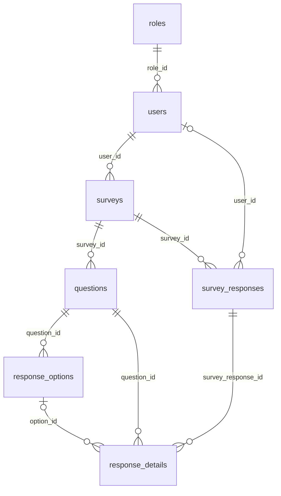

# Backend explicado para la sustentación

> Documento elaborado leyendo el código del backend, sus entidades y `init_database.sql`. Las referencias indican la fuente concreta; cuando se menciona un método, ese método es el ancla de la explicación. La existencia de una ruta en el código no demuestra que esté desplegada o probada en vivo. La estructura real usa el nombre `infraestrucure` (con esa ortografía).

## 1. Mapa general del proyecto

### Arquitectura en palabras simples

El proyecto separa las reglas y los modelos del negocio (`domain`) del trabajo que realiza cada caso de uso (`application`). La infraestructura (`infraestrucure`) conecta ese núcleo con HTTP/Express y con PostgreSQL mediante TypeORM. Los puertos del dominio describen lo que necesita la aplicación; los adapters implementan esos contratos. Por ejemplo, crear usuario entra por `POST /users`, lo recibe `UserController.createUser`, pasa por `UserApplication.createUser` y termina en `UserAdapter.createUser`, que convierte el modelo y guarda una fila en PostgreSQL. Fuentes: [UserRoutes](../src/infraestrucure/routes/UserRoutes.ts), [UserController.createUser](../src/infraestrucure/controller/UserController.ts), [UserApplication.createUser](../src/application/UserApplication.ts), [UserAdapter.createUser](../src/infraestrucure/adapter/UserAdapter.ts), [UserPort](../src/domain/UserPort.ts).

Esta separación ayuda a que las reglas de aplicación no tengan que escribir SQL directamente ni conocer objetos `req`/`res` de Express. En la práctica, la separación no es uniforme en todos los módulos: `RoleRoutes` consulta TypeORM directamente y parte del flujo de login y recuperación de contraseña vive en `UserController`.

### Árbol comentado

```text
src/
├── index.ts                         # Inicia conexión DB y servidor HTTP.
├── domain/                          # Modelos de negocio y puertos/interfaces.
├── application/                     # Casos de uso y reglas que coordinan el dominio.
└── infraestrucure/
    ├── adapter/                     # Implementaciones TypeORM de los puertos.
    ├── bootstrap/                   # Creación y escucha del servidor HTTP.
    ├── config/                      # DataSource PostgreSQL y validación de variables.
    ├── controller/                  # Convierte HTTP en llamadas de aplicación y JSON.
    ├── entities/                    # Mapeo TypeORM entre clases y tablas.
    ├── routes/                      # Endpoints, middleware por ruta y composición de dependencias.
    ├── util/                        # Esquemas Joi, conversión de email/imagen y alias JWT.
    └── web/                         # Express, middlewares globales, JWT y autorización por rol.
docs/
├── BACKEND.md                       # Documentación existente, no sustituye la lectura del código.
└── BACKEND-EXPLICADO.md             # Este documento.
```

Fuentes del árbol: [src/index.ts](../src/index.ts), [application](../src/application/), [domain](../src/domain/), [infraestrucure](../src/infraestrucure/), [docs/BACKEND.md](BACKEND.md).

### Conceptos que puede preguntar el jurado

- **Express:** biblioteca de Node.js usada para recibir peticiones HTTP y definir rutas como `POST /api/users`. En este proyecto también registra middleware global y monta routers en `App.middlewares` y `App.routes`. [package.json](../package.json), [App](../src/infraestrucure/web/app.ts).
- **TypeORM:** ORM, es decir, una herramienta que relaciona clases TypeScript con tablas y permite consultar/guardar mediante repositorios. Aquí `DataSource` configura PostgreSQL y los adapters usan métodos como `findOne`, `save`, `update` y `createQueryBuilder`. [data-base.ts](../src/infraestrucure/config/data-base.ts), [UserAdapter](../src/infraestrucure/adapter/UserAdapter.ts).
- **Middleware:** función de Express que puede revisar o transformar una petición antes del handler, o terminarla con una respuesta. `authenticateToken` revisa el JWT; los validadores Joi comprueban el body antes de entrar al controller. [authMiddleware.authenticateToken](../src/infraestrucure/web/authMiddleware.ts), [validateSurveyPayload](../src/infraestrucure/util/surveyValidator.ts).
- **JWT (JSON Web Token):** cadena firmada que el servidor entrega tras el login. En este backend contiene `id`, `email` y `roleId`, se firma mediante `AuthApplication.generateToken` y dura dos horas; los middlewares la verifican en rutas protegidas. [AuthApplication.generateToken](../src/application/AuthApplication.ts), [UserController.loginUser](../src/infraestrucure/controller/UserController.ts), [authenticateToken](../src/infraestrucure/web/authMiddleware.ts).
- **bcrypt:** biblioteca que crea hashes lentos de contraseñas y los compara sin guardar la contraseña original. El alta usa `bcryptjs.hash(..., 10)`, el login usa `bcrypt.compare` y la edición/restablecimiento vuelve a hashear. El paquete declara tanto `bcrypt` como `bcryptjs`. [package.json](../package.json), [UserApplication](../src/application/UserApplication.ts), [UserController](../src/infraestrucure/controller/UserController.ts).
- **Validación con Joi:** esquema declarativo para decidir qué campos, formatos y valores se aceptan; si hay error, el backend devuelve un 400. El proyecto lo usa, por ejemplo, para los datos de usuario y el payload de una respuesta. [user_validation.ts](../src/infraestrucure/util/user_validation.ts), [surveyResponseValidator.ts](../src/infraestrucure/util/surveyResponseValidator.ts).

### Arranque y orden de routers

`src/index.ts` importa la app Express y llama `connectDB()` y `serverBootstrap.initialize()` dentro de `Promise.all`; ambas tareas comienzan en paralelo. `ServerBootstrap.initialize` escucha en `PORT` y tiene fallback a `4000`, pero `environment-vars.ts` exige `PORT` al cargar el módulo, así que si falta esa variable la validación puede fallar antes de usar el fallback. `data-base.ts` configura PostgreSQL con `synchronize: false` y logging activado. [index.ts](../src/index.ts), [ServerBootstrap.initialize](../src/infraestrucure/bootstrap/server.bootstrap.ts), [environment-vars.ts](../src/infraestrucure/config/environment-vars.ts), [data-base.ts](../src/infraestrucure/config/data-base.ts).

`App` registra globalmente, en este orden: CORS para `http://localhost:4200` con credenciales; `express.json` con límite de 50 MB; `express.urlencoded` extendido con límite de 50 MB; routers bajo `/api` en orden `RoleRoutes`, `UserRoutes`, `SurveyRoutes`, `SurveyResponseRoutes`; por último `GET /api/health`. [App.middlewares y App.routes](../src/infraestrucure/web/app.ts).

## 2. Flujos completos, paso a paso

### Registro de usuario

Llega `POST /api/users` a `UserRoutes`; no requiere token y el handler delega a `UserController.createUser`. El controller llama `loadUserData`, que exige nombre (mínimo 3 caracteres), email con formato válido y contraseña (mínimo 6), y luego arma un objeto de usuario con `name`, `email`, `password` y `status`. `UserApplication.createUser` consulta por email para evitar duplicados y genera el hash con `bcryptjs.hash(password, 10)` antes de llamar al puerto. `UserAdapter.createUser` convierte a entidad TypeORM, normaliza el email con minúsculas y `trim`, asigna rol `STUDENT` si no recibió rol y guarda con `userRepository.save`; la respuesta es `201` con el nuevo `userId`. La contraseña se hashea para no persistir el secreto original: la entidad la guarda en `password_hash` y el adapter la llama `passwordHash`. [UserRoutes](../src/infraestrucure/routes/UserRoutes.ts), [UserController.createUser](../src/infraestrucure/controller/UserController.ts), [loadUserData](../src/infraestrucure/util/user_validation.ts), [UserApplication.createUser](../src/application/UserApplication.ts), [UserAdapter.toEntity y createUser](../src/infraestrucure/adapter/UserAdapter.ts), [User](../src/infraestrucure/entities/User.ts).

**Detalle importante:** el esquema Joi permite `avatarBase64` y `roleId`, pero `createUser` no los copia al objeto que manda a la aplicación. Por eso la ruta de alta, tal como está escrita, no persiste la foto enviada y no permite elegir el rol mediante ese campo; el adapter aplica su valor por defecto. [UserController.createUser](../src/infraestrucure/controller/UserController.ts), [user_validation.ts](../src/infraestrucure/util/user_validation.ts), [UserAdapter.toEntity](../src/infraestrucure/adapter/UserAdapter.ts).

### Login y creación del JWT

`POST /api/users/login` (también alias `POST /api/login`) llega a `UserController.loginUser`; ambos endpoints son públicos. El controller verifica que vengan `email` y `password`, llama `UserApplication.getUserByEmail`, compara la contraseña recibida contra el hash con `bcrypt.compare` y, si coincide, llama `AuthApplication.generateToken` con `{id, email, roleId}`. `AuthApplication` firma usando `process.env.JWT_SECRET` o su fallback de desarrollo, y fija `expiresIn: "2h"`. El controller responde `200` con el token y el usuario sin la propiedad password; si el usuario no existe o la contraseña no coincide, devuelve el mismo `401 Credenciales inválidas`. [UserRoutes](../src/infraestrucure/routes/UserRoutes.ts), [UserController.loginUser](../src/infraestrucure/controller/UserController.ts), [UserApplication.getUserByEmail](../src/application/UserApplication.ts), [AuthApplication.generateToken](../src/application/AuthApplication.ts).

En el login HTTP vigente no se consulta el estado del usuario antes de emitir el token. `UserApplication.login` sí comprueba estado, pero las rutas no llaman a ese método; la comprobación observada corresponde a `UserController.loginUser`. [UserController.loginUser](../src/infraestrucure/controller/UserController.ts), [UserApplication.login](../src/application/UserApplication.ts), [UserRoutes](../src/infraestrucure/routes/UserRoutes.ts).

### Verificación del token y rol administrador

En una ruta protegida, `authenticateToken` lee el header `Authorization`, toma el segundo fragmento de `Bearer <token>` y llama a `AuthApplication.verifyToken`. Si la firma y vigencia son correctas, guarda el payload en `req.user` y continúa; si no hay token responde 401, y si es inválido o venció responde 403. `authorizeRole(1)` toma `req.user.roleId` (o alternativamente `req.user.role`) y exige que coincida estrictamente con el rol permitido; de lo contrario responde 403. En `UserRoutes`, ambos middlewares se usan para bajas/reactivación; otras rutas de usuario solo usan `authenticateToken`. [authenticateToken](../src/infraestrucure/web/authMiddleware.ts), [AuthApplication.verifyToken](../src/application/AuthApplication.ts), [authorizeRole](../src/infraestrucure/web/roleMiddleware.ts), [UserRoutes](../src/infraestrucure/routes/UserRoutes.ts).

### Pedir recuperación de contraseña y restablecerla

`POST /api/forgot-password` recibe `email` en `UserController.sendRecoveryEmail`. Si falta, responde 400. La aplicación busca el usuario y, si no existe o está inactivo, devuelve `null`; el controller responde 200 con el mismo mensaje genérico que usa cuando sí manda correo, para no confirmar si una dirección está registrada. Si encuentra usuario activo, `UserApplication.generatePasswordResetToken` firma `{id,email}` con el mismo secreto configurable/fallback y expiración de 15 minutos; el controller arma un enlace usando `FRONTEND_URL` o `http://localhost:4200`, configura Nodemailer para Gmail con `GMAIL_USER` y `GMAIL_APP_PASSWORD`, y manda el email. [UserRoutes](../src/infraestrucure/routes/UserRoutes.ts), [UserController.sendRecoveryEmail](../src/infraestrucure/controller/UserController.ts), [UserApplication.generatePasswordResetToken](../src/application/UserApplication.ts).

Luego `POST /api/reset-password` recibe `{token,newPassword}`. El controller exige ambos campos y llama a `UserApplication.resetPassword`; la aplicación verifica el JWT, genera un nuevo hash con factor 10 y llama `UserPort.updateUser` con el ID del token. Si el token es inválido o expiró, responde con el error de enlace inválido/expirado. No se ve un segundo control de longitud Joi para la nueva contraseña en este endpoint. [UserRoutes](../src/infraestrucure/routes/UserRoutes.ts), [UserController.resetPassword](../src/infraestrucure/controller/UserController.ts), [UserApplication.resetPassword](../src/application/UserApplication.ts), [UserPort.updateUser](../src/domain/UserPort.ts).

### Actualizar perfil y foto

No hay ruta separada llamada “perfil”: el flujo disponible es `PUT` o `PATCH /api/users/:id`, que exige JWT pero no comprueba que el ID de la URL pertenezca a quien inició sesión. `UserController.updateUser` valida ID y usa `loadUpdateUserData`; `UserApplication.updateUser` verifica existencia, evita email duplicado y re-hashea la contraseña si llegó. `UserAdapter.updateUser` cambia solo los campos presentes. Si llega `avatarBase64`, `compressImage` acepta Data URL o Base64, guarda el binario comprimido con gzip en `users.photo_data` y el MIME en `users.photo_mime_type`; al leer, `toDomain` lo reconstruye como `avatarBase64`. Enviar cadena vacía o null limpia esos datos. [UserRoutes](../src/infraestrucure/routes/UserRoutes.ts), [UserController.updateUser](../src/infraestrucure/controller/UserController.ts), [loadUpdateUserData](../src/infraestrucure/util/user-update-validation.ts), [UserApplication.updateUser](../src/application/UserApplication.ts), [UserAdapter.updateUser y toDomain](../src/infraestrucure/adapter/UserAdapter.ts), [compressImage/decompressImage](../src/infraestrucure/util/imageCompressor.ts), [User](../src/infraestrucure/entities/User.ts).

### Crear encuesta con preguntas y opciones

`POST /api/surveys` pasa por `validateSurveyPayload` y luego `SurveyController.create`. El middleware Joi revisa `title`, `description`, `closeDate` y `userId`, pero deja pasar `questions` como campo desconocido sin validarlo. El controller entrega esos datos a `SurveyApplication.createSurvey`, que comprueba que título y creador no estén vacíos y asigna `status: 1`. `SurveyAdapter.save` abre una transacción, crea primero la encuesta y llama `guardarPreguntas`, que crea cada pregunta y sus opciones asociándolas por IDs. La transacción agrupa cabecera, preguntas y opciones: si una operación rechaza la promesa, TypeORM revierte la transacción y no debe quedar creada solo una parte. El controller devuelve `201` y `surveyId`. El mensaje dice “Borrador”, aunque application y adapter asignan status 1 y otros mensajes llaman a ese estado activo/publicado. [SurveyRoutes](../src/infraestrucure/routes/SurveyRoutes.ts), [validateSurveyPayload](../src/infraestrucure/util/surveyValidator.ts), [SurveyController.create](../src/infraestrucure/controller/SurveyController.ts), [SurveyApplication.createSurvey](../src/application/SurveyApplication.ts), [SurveyAdapter.save y guardarPreguntas](../src/infraestrucure/adapter/SurveyAdapter.ts).

### Editar encuesta existente

`PUT /api/surveys/:id` no tiene autenticación, pero sí reutiliza el validador Joi de creación, por lo que también exige `title` y `userId`. `SurveyApplication.updateSurvey` busca la encuesta, falla si no existe y no permite modificarla si status es 0; no distingue un supuesto estado borrador de una encuesta activa. `SurveyAdapter.update` actualiza título/descripción/fecha/estado que hayan llegado. Si el body incluye `questions`, dentro de una transacción marca status 0 a las preguntas y opciones actuales y crea nuevas; no las borra físicamente, para preservar las referencias del historial de respuestas. No actualiza `userId`. [SurveyRoutes](../src/infraestrucure/routes/SurveyRoutes.ts), [SurveyApplication.updateSurvey](../src/application/SurveyApplication.ts), [SurveyAdapter.update y guardarPreguntas](../src/infraestrucure/adapter/SurveyAdapter.ts).

### Listar encuestas, cantidad de preguntas y completado

`GET /api/surveys` llega a `SurveyController.getAll` sin autenticar. `includeInactive=true` incluye encuestas inactivas; de lo contrario, el adapter conserva status 1. `SurveyAdapter.findAll` calcula el total de preguntas activas con `SELECT survey_id, COUNT(*) ... FROM questions WHERE status::text = '1' GROUP BY survey_id`. Si recibe `userId`, otra consulta obtiene `DISTINCT survey_id` de `survey_responses` para ese usuario, y `completed` será true si aparece la encuesta. Esa segunda consulta no filtra respuestas inactivas. [SurveyRoutes](../src/infraestrucure/routes/SurveyRoutes.ts), [SurveyController.getAll](../src/infraestrucure/controller/SurveyController.ts), [SurveyApplication.getAllSurveys](../src/application/SurveyApplication.ts), [SurveyAdapter.findAll](../src/infraestrucure/adapter/SurveyAdapter.ts).

### Responder encuesta

La ruta `POST /api/surveys/:surveyId/responses` pasa por `validateSurveyResponse`, pero no por JWT. El formato esperado incluye en el JSON un `surveyId` positivo (aunque también va en la URL), un `details` no vacío y, opcionalmente, `userId` o `user.id`. Cada detalle pide `questionId` y uno de `optionId` o `responseText`. Ejemplo:

```json
{
  "surveyId": 12,
  "userId": 34,
  "details": [
    { "questionId": 101, "optionId": 203 },
    { "questionId": 102, "optionId": 204 },
    { "questionId": 103, "responseText": "Respuesta abierta" }
  ]
}
```

El controller toma el surveyId de la URL, normaliza los IDs del body y llama a `SurveyResponseApplication.submitResponse`. El adapter crea una cabecera en `survey_responses` y persiste en cascada un `response_details` por elemento. Una opción única se representa con un detalle y `optionId`; una selección múltiple puede enviarse como varios detalles con el mismo `questionId` y distintos `optionId`; una abierta usa `responseText`. El código no impone una forma distinta de persistencia según `questionType`, ni valida que pregunta/opción pertenezca a la encuesta. Si PostgreSQL devuelve `23505`, el controller responde 409 diciendo que solo se permite un intento; sin embargo, el SQL leído no define `UNIQUE(survey_id,user_id)` y el adapter no consulta respuestas previas. Por tanto, que realmente se impida duplicar queda **NO VERIFICADO** y no está garantizado por el esquema entregado. [surveyResponseRoutes](../src/infraestrucure/routes/surveyResponseRoutes.ts), [validateSurveyResponse](../src/infraestrucure/util/surveyResponseValidator.ts), [SurveyResponseController.submit](../src/infraestrucure/controller/SurveyResponseController.ts), [SurveyResponseApplication.submitResponse](../src/application/SurveyResponseApplication.ts), [SurveyResponseAdapter.saveResponse](../src/infraestrucure/adapter/SurveyResponseAdapter.ts), [init_database.sql](../init_database.sql).

### Obtener resultados de encuesta

`GET /api/surveys/:surveyId/responses` es público. `SurveyResponseController.getResults` valida el ID y llama a `SurveyResponseApplication.getResults`; el adapter busca respuestas por encuesta, carga sus detalles y ordena por `surveyResponseId`. Devuelve cabecera (`surveyResponseId`, fecha, surveyId, userId, status) y detalles (`detailId`, questionId, optionId, responseText, status). No agrega conteos ni incorpora texto de preguntas, opciones o usuario. [surveyResponseRoutes](../src/infraestrucure/routes/surveyResponseRoutes.ts), [SurveyResponseController.getResults](../src/infraestrucure/controller/SurveyResponseController.ts), [SurveyResponseApplication.getResults](../src/application/SurveyResponseApplication.ts), [SurveyResponseAdapter.getResponsesBySurvey](../src/infraestrucure/adapter/SurveyResponseAdapter.ts).

Hay además rutas públicas `GET /api/surveys/:surveyId/estudiantes` y `GET /api/surveys/:surveyId/estudiantes/:studentId/respuestas`; el adapter arma consultas `QueryBuilder` con JOINs para sacar usuarios y respuestas legibles. [surveyResponseRoutes](../src/infraestrucure/routes/surveyResponseRoutes.ts), [SurveyResponseController.getStudentsBySurvey/getStudentAnswers](../src/infraestrucure/controller/SurveyResponseController.ts), [SurveyResponseAdapter.getStudentsBySurvey/getStudentAnswers](../src/infraestrucure/adapter/SurveyResponseAdapter.ts).

## 3. Ficha por archivo

En cada fila se indica archivo y responsabilidad. Los archivos con su método detallado en la sección 4 enlazan allí por su nombre de clase/método; las funciones de configuración y contratos también incluyen aquí su fuente.

### Routes

| Archivo | Qué es y qué responsabilidad tiene |
|---|---|
| [RoleRoutes.ts](../src/infraestrucure/routes/RoleRoutes.ts) | Define CRUD lógico de roles directamente con `RoleEntity` y `AppDataSource`; no pasa por application/adapter y no instala autorización. |
| [UserRoutes.ts](../src/infraestrucure/routes/UserRoutes.ts) | Conecta `UserAdapter` → `UserApplication` → `UserController` y declara rutas públicas, rutas JWT y tres operaciones con rol 1. |
| [SurveyRoutes.ts](../src/infraestrucure/routes/SurveyRoutes.ts) | Conecta adapter/application/controller de encuestas; valida create/update con `validateSurveyPayload`. |
| [surveyResponseRoutes.ts](../src/infraestrucure/routes/surveyResponseRoutes.ts) | Conecta el flujo de respuestas y registra envío, resultados, estudiantes y respuestas individuales. |

### Controllers

| Archivo | Qué es y qué responsabilidad tiene |
|---|---|
| [UserController.ts](../src/infraestrucure/controller/UserController.ts) | Convierte peticiones de usuario/login/recuperación en llamadas a `UserApplication` y responde con códigos HTTP y JSON. |
| [SurveyController.ts](../src/infraestrucure/controller/SurveyController.ts) | Lee parámetros/query/body de encuestas y expresa el resultado de los casos de uso en respuestas HTTP. |
| [SurveyResponseController.ts](../src/infraestrucure/controller/SurveyResponseController.ts) | Normaliza IDs/respuestas, maneja duplicados y responde consultas de resultados/estudiantes. |

### Application

| Archivo | Qué es y qué responsabilidad tiene |
|---|---|
| [AuthApplication.ts](../src/application/AuthApplication.ts) | Firma y verifica JWT con secreto compartido y expiración de dos horas en los tokens de login. |
| [UserApplication.ts](../src/application/UserApplication.ts) | Reglas de usuario: email repetido, hash de contraseña, actualización, estado y recuperación. |
| [SurveyApplication.ts](../src/application/SurveyApplication.ts) | Reglas para crear/listar/editar/publicar/reactivar/inactivar encuestas. |
| [SurveyResponseApplication.ts](../src/application/SurveyResponseApplication.ts) | Comprueba datos mínimos de envío/resultados y delega persistencia/consultas al puerto. |

### Adapter

| Archivo | Qué es y qué responsabilidad tiene |
|---|---|
| [UserAdapter.ts](../src/infraestrucure/adapter/UserAdapter.ts) | Implementa `UserPort`; traduce campos entidad/dominio, foto y operaciones de usuario con repositorios TypeORM. |
| [SurveyAdapter.ts](../src/infraestrucure/adapter/SurveyAdapter.ts) | Implementa `SurveyPort`; persiste encuestas, preguntas/opciones y consulta conteos/estado de respuesta. |
| [SurveyResponseAdapter.ts](../src/infraestrucure/adapter/SurveyResponseAdapter.ts) | Persiste cabeceras/detalles de respuestas y arma consultas de resultados y estudiantes. |

### Domain

| Archivo | Qué es y qué responsabilidad tiene |
|---|---|
| [Question.ts](../src/domain/Question.ts) | Tipos de pregunta, estado, asociación a encuesta y opciones. |
| [ResponseOption.ts](../src/domain/ResponseOption.ts) | Modelo de opción con texto, orden y estado. |
| [Survey.ts](../src/domain/Survey.ts) | Modelo de encuesta y tipos para preguntas, opciones, estado, conteo y completado. |
| [SurveyPort.ts](../src/domain/SurveyPort.ts) | Contrato que debe cumplir el adapter de encuestas. |
| [SurveyResponse.ts](../src/domain/SurveyResponse.ts) | Modelos de cabecera/detalle de respuestas y el puerto de persistencia/consulta. |
| [User.ts](../src/domain/User.ts) | Modelo de usuario de negocio, incluyendo foto Base64, contraseña lógica, estado y rol. |
| [UserPort.ts](../src/domain/UserPort.ts) | Contrato para crear/actualizar/buscar/inactivar/reactivar usuarios. |

### Entities

| Archivo | Qué es y qué responsabilidad tiene |
|---|---|
| [QuestionEntity.ts](../src/infraestrucure/entities/QuestionEntity.ts) | Mapea la tabla `questions` y sus relaciones con encuesta y opciones. |
| [ResponseDetailEntity.ts](../src/infraestrucure/entities/ResponseDetailEntity.ts) | Mapea `response_details` y sus referencias a envío, pregunta y opción. |
| [ResponseOptionEntity.ts](../src/infraestrucure/entities/ResponseOptionEntity.ts) | Mapea `response_options` y su relación con una pregunta. |
| [RoleEntity.ts](../src/infraestrucure/entities/RoleEntity.ts) | Mapea `roles` y su colección de usuarios. |
| [Survey.ts](../src/infraestrucure/entities/Survey.ts) | Clase `SurveyEntity`: mapea `surveys` y relaciones con creador/preguntas. |
| [SurveyResponseEntity.ts](../src/infraestrucure/entities/SurveyResponseEntity.ts) | Mapea `survey_responses`, usuario/encuesta y detalles en cascada. |
| [User.ts](../src/infraestrucure/entities/User.ts) | Mapea `users`, incluyendo hash, estado, rol y bytes/MIME de foto. |

### Web y utilidades

| Archivo | Qué es y qué responsabilidad tiene |
|---|---|
| [app.ts](../src/infraestrucure/web/app.ts) | Construye Express, aplica CORS y parsers globales y monta los routers. |
| [authMiddleware.ts](../src/infraestrucure/web/authMiddleware.ts) | Verifica header Bearer y deja el payload JWT en `req.user`. |
| [roleMiddleware.ts](../src/infraestrucure/web/roleMiddleware.ts) | Exige que `roleId`/`role` esté entre los roles permitidos. |
| [email-validation.ts](../src/infraestrucure/util/email-validation.ts) | Valida el email de parámetros con Joi y rechaza claves extra. |
| [imageCompressor.ts](../src/infraestrucure/util/imageCompressor.ts) | Convierte Base64 a bytes gzip y reconstruye una Data URL al leer. |
| [jwt-middleware.ts](../src/infraestrucure/util/jwt-middleware.ts) | Reexporta `authenticateToken` como `verifyToken`; no implementa otra verificación. |
| [questionValidator.ts](../src/infraestrucure/util/questionValidator.ts) | Define un esquema Joi para preguntas/opciones, pero no se conecta a `SurveyRoutes`. |
| [surveyResponseValidator.ts](../src/infraestrucure/util/surveyResponseValidator.ts) | Valida el body de envío de respuestas con Joi. |
| [surveyValidator.ts](../src/infraestrucure/util/surveyValidator.ts) | Middleware Joi para el body de encuesta; no inspecciona el contenido de `questions`. |
| [user-update-validation.ts](../src/infraestrucure/util/user-update-validation.ts) | Valida campos opcionales para actualizar usuario. |
| [user_validation.ts](../src/infraestrucure/util/user_validation.ts) | Valida campos de creación de usuario. |

Los archivos de entrada/configuración que completan el arranque, aunque no pertenecen a las carpetas enumeradas en la tabla anterior, son [index.ts](../src/index.ts), [server.bootstrap.ts](../src/infraestrucure/bootstrap/server.bootstrap.ts), [data-base.ts](../src/infraestrucure/config/data-base.ts) y [environment-vars.ts](../src/infraestrucure/config/environment-vars.ts).

## 4. Ficha por función/método

### Controllers

- **`UserController.loginUser`**: valida presencia de credenciales, busca el usuario, compara bcrypt, firma JWT y elimina password de la respuesta. No llama al método `UserApplication.login`; tampoco comprueba estado activo. [UserController.loginUser](../src/infraestrucure/controller/UserController.ts), [UserApplication.login](../src/application/UserApplication.ts).
- **`UserController.createUser`**: valida body, arma el objeto de alta, delega y convierte email duplicado a 409. Ignora `avatarBase64` y `roleId` aunque Joi los admita. [UserController.createUser](../src/infraestrucure/controller/UserController.ts).
- **`UserController.updateUser`**: valida ID/body y manda un `Partial<User>`; la aplicación decide email/hash y el adapter actualiza propiedades presentes. [UserController.updateUser](../src/infraestrucure/controller/UserController.ts).
- **`UserController.getUserById` / `getUserByEmail`**: valida parámetro, consulta y excluye password del JSON. [UserController.getUserById/getUserByEmail](../src/infraestrucure/controller/UserController.ts).
- **`UserController.getAllUsers`**: traduce `includeInactive=true` y excluye password de cada elemento. [UserController.getAllUsers](../src/infraestrucure/controller/UserController.ts).
- **`UserController.deleteUser` / `deactivateUser` / `activateUser`**: validan ID y delegan cambio lógico de estado; ninguno borra la fila. [UserController](../src/infraestrucure/controller/UserController.ts).
- **`UserController.sendRecoveryEmail`**: pide token temporal, construye link y manda correo por Nodemailer/Gmail; responde genéricamente si no existe la cuenta. [UserController.sendRecoveryEmail](../src/infraestrucure/controller/UserController.ts).
- **`UserController.resetPassword`**: exige token y contraseña nueva, delega verificación/hash y devuelve 200 o 400. [UserController.resetPassword](../src/infraestrucure/controller/UserController.ts).
- **`SurveyController.create`**: obtiene `userId` de `body.user.id` o `body.userId` y pasa preguntas/fechas a application. [SurveyController.create](../src/infraestrucure/controller/SurveyController.ts).
- **`SurveyController.getAll` / `getById`**: traduce query/path; por ID comprueba entero positivo. [SurveyController](../src/infraestrucure/controller/SurveyController.ts).
- **`SurveyController.update`**: manda `req.body` a application; valida ID, pero el middleware de ruta ya impone también campos obligatorios de creación. [SurveyController.update](../src/infraestrucure/controller/SurveyController.ts), [SurveyRoutes](../src/infraestrucure/routes/SurveyRoutes.ts).
- **`SurveyController.publish` / `activate` / `deactivate`**: validan ID y piden cambio de estado. **`delete`** delega directamente a `deactivate`, así que DELETE es baja lógica. [SurveyController](../src/infraestrucure/controller/SurveyController.ts).
- **`SurveyResponseController.submit`**: toma el ID de ruta, userId opcional del body, normaliza IDs de detalle y convierte error unique-key a 409. El control de duplicado solo traduce el error; no busca un envío anterior. [SurveyResponseController.submit](../src/infraestrucure/controller/SurveyResponseController.ts).
- **`SurveyResponseController.getResults`**: valida ID y devuelve envíos detallados por encuesta. [SurveyResponseController.getResults](../src/infraestrucure/controller/SurveyResponseController.ts).
- **`SurveyResponseController.getStudentsBySurvey` / `getStudentAnswers`**: validan IDs básicos y delegan al servicio mediante `as any`; esos métodos no están declarados en `SurveyResponsePort`. [SurveyResponseController](../src/infraestrucure/controller/SurveyResponseController.ts), [SurveyResponsePort](../src/domain/SurveyResponse.ts).

### Application

- **`AuthApplication.generateToken`** firma el payload recibido con secreto de entorno o fallback de desarrollo y vigencia de `2h`; **`verifyToken`** llama a `jwt.verify` con la misma constante. [AuthApplication](../src/application/AuthApplication.ts).
- **`UserApplication.createUser`** comprueba email duplicado y hashea a factor 10 antes de invocar el puerto. [UserApplication.createUser](../src/application/UserApplication.ts).
- **`UserApplication.login`** también implementa autenticación y sí revisa estado activo, pero no lo usa ninguna ruta actual. Su payload usa `userId`, mientras el controller HTTP vigente usa `id`. [UserApplication.login](../src/application/UserApplication.ts), [UserRoutes](../src/infraestrucure/routes/UserRoutes.ts).
- **`UserApplication.getUserById/getUserByEmail/getAllUsers`** son delegaciones sencillas al puerto. [UserApplication](../src/application/UserApplication.ts).
- **`UserApplication.updateUser`** requiere usuario existente, evita correo duplicado y vuelve a hashear password si se envía. [UserApplication.updateUser](../src/application/UserApplication.ts).
- **`UserApplication.deleteUser/deactivateUser/activateUser`** delegan cambios lógicos al puerto. [UserApplication](../src/application/UserApplication.ts).
- **`UserApplication.generatePasswordResetToken`** devuelve null si el usuario no existe o está inactivo; si existe, firma un JWT temporal de 15 minutos con `id/email`. **`resetPassword`** verifica, hashea y actualiza; ante cualquier error de JWT devuelve el mensaje de enlace inválido/expirado. [UserApplication](../src/application/UserApplication.ts).
- **`SurveyApplication.createSurvey`** exige title y userId truthy y asigna `status: 1`. **Nota:** el controller llama ese estado “Borrador” mientras otros handlers lo describen como activo/publicado. [SurveyApplication.createSurvey](../src/application/SurveyApplication.ts), [SurveyController.create](../src/infraestrucure/controller/SurveyController.ts).
- **`SurveyApplication.getAllSurveys/getSurveyById`** delegan la consulta; `getSurveyById` convierte null a error. [SurveyApplication](../src/application/SurveyApplication.ts).
- **`SurveyApplication.updateSurvey`** comprueba existencia y rechaza status 0, pero no rechaza status 1. **Nota:** comentario/documentación puede llamar borrador a la condición, pero la regla ejecutable es “no inactiva”. [SurveyApplication.updateSurvey](../src/application/SurveyApplication.ts).
- **`SurveyApplication.publishSurvey/activateSurvey/deactivateSurvey`** comprueban existencia y transición de estado antes de delegar. `deleteSurvey` equivale a `deactivateSurvey`; las rutas llaman al método controller `deactivate`. [SurveyApplication](../src/application/SurveyApplication.ts).
- **`SurveyResponseApplication.submitResponse`** exige surveyId y al menos un detail; no verifica tipos, propiedad de preguntas ni duplicados. **`getResults`** solo comprueba que haya ID. [SurveyResponseApplication](../src/application/SurveyResponseApplication.ts).
- **`SurveyResponseApplication.getStudentsBySurvey/getStudentAnswers`** comprueban IDs truthy y llaman métodos del port mediante `as any`. **Nota:** la interfaz del puerto no declara esos métodos aunque el adapter sí los implementa. [SurveyResponseApplication](../src/application/SurveyResponseApplication.ts), [SurveyResponsePort](../src/domain/SurveyResponse.ts), [SurveyResponseAdapter](../src/infraestrucure/adapter/SurveyResponseAdapter.ts).

### Adapters

- **`UserAdapter.toDomain`** cambia `userId` a `id`, `passwordHash` a `password`, y `photoData/photoMimeType` a `avatarBase64`; expone el mismo estado como `status` y `statusUser`. [UserAdapter.toDomain](../src/infraestrucure/adapter/UserAdapter.ts).
- **`UserAdapter.toEntity`** cambia `password` a `passwordHash`, normaliza email, comprime foto y elige `STUDENT` si no llega `roleId`; si no encuentra STUDENT asigna rol 1. [UserAdapter.toEntity](../src/infraestrucure/adapter/UserAdapter.ts).
- **`UserAdapter.createUser/updateUser`** insertan/actualizan mediante repositorio. `updateUser` también puede cambiar status y roleId si la application le entrega esos campos. [UserAdapter](../src/infraestrucure/adapter/UserAdapter.ts).
- **`UserAdapter.deleteUser`** solo llama a `deactivateUser`; **`deactivateUser/activateUser`** guardan status 0/1. [UserAdapter](../src/infraestrucure/adapter/UserAdapter.ts).
- **`UserAdapter.getUserById/getUserByEmail/getAllUsers`** usan `findOne`/`find`; email se normaliza; por defecto la lista filtra status 1. [UserAdapter](../src/infraestrucure/adapter/UserAdapter.ts).
- **`SurveyAdapter.toDomain`** mapea `SurveyEntity` al contrato de dominio y crea alias `statusSurvey` además de `status`. [SurveyAdapter.toDomain](../src/infraestrucure/adapter/SurveyAdapter.ts).
- **`SurveyAdapter.guardarPreguntas`** inserta preguntas/opciones mediante repositorios del `EntityManager` recibido para compartir la transacción. [SurveyAdapter.guardarPreguntas](../src/infraestrucure/adapter/SurveyAdapter.ts).
- **`SurveyAdapter.save`** abre transacción para guardar survey + preguntas + opciones; si falla la operación, la unidad se revierte. [SurveyAdapter.save](../src/infraestrucure/adapter/SurveyAdapter.ts).
- **`SurveyAdapter.findAll`** aplica filtro de estado en memoria, ejecuta conteo agrupado de preguntas y consulta distinta por usuario; completa `totalQuestions` y `completed`. **Nota:** la segunda SQL no filtra `status` de respuesta. [SurveyAdapter.findAll](../src/infraestrucure/adapter/SurveyAdapter.ts).
- **`SurveyAdapter.findById`** busca entidad, carga preguntas/opciones ordenadas y devuelve solo las activas. [SurveyAdapter.findById](../src/infraestrucure/adapter/SurveyAdapter.ts).
- **`SurveyAdapter.update`** agrupa campos generales y reemplazo lógico de preguntas dentro de transacción. Marca antiguas opciones y preguntas inactivas, no las elimina; inserta las nuevas. [SurveyAdapter.update](../src/infraestrucure/adapter/SurveyAdapter.ts).
- **`SurveyAdapter.updateStatus/deactivate/activate`** ejecutan update de estado, sin borrado físico. [SurveyAdapter](../src/infraestrucure/adapter/SurveyAdapter.ts).
- **`SurveyResponseAdapter.saveResponse`** crea una cabecera y asocia detalles para guardarlos en cascada. No consulta respuesta previa ni valida referencias contra encuesta. [SurveyResponseAdapter.saveResponse](../src/infraestrucure/adapter/SurveyResponseAdapter.ts), [SurveyResponseEntity](../src/infraestrucure/entities/SurveyResponseEntity.ts).
- **`SurveyResponseAdapter.getResponsesBySurvey`** carga cabeceras más relación `details`, ordenadas por ID ascendente; no trae preguntas/opciones/usuario ni filtra estado. [SurveyResponseAdapter.getResponsesBySurvey](../src/infraestrucure/adapter/SurveyResponseAdapter.ts).
- **`SurveyResponseAdapter.getStudentsBySurvey`** usa QueryBuilder con JOIN de `survey_responses` a `users`, filtra por encuesta y respuestas status 1 y ordena más recientes primero. Devuelve alias español `estudianteId`, `nombre`, `correo`, `fechaRespuesta`. [SurveyResponseAdapter.getStudentsBySurvey](../src/infraestrucure/adapter/SurveyResponseAdapter.ts).
- **`SurveyResponseAdapter.getStudentAnswers`** hace JOIN entre respuesta, detalles y preguntas, LEFT JOIN a opciones; filtra encuesta/estudiante y estados activos de respuesta/detalle. Devuelve una cadena `respuesta` escogiendo `optionText || responseText || ''`; si hay opción múltiple habrá una fila por detalle/opción. [SurveyResponseAdapter.getStudentAnswers](../src/infraestrucure/adapter/SurveyResponseAdapter.ts).

### Consultas no triviales y transacciones

- En `SurveyAdapter.findAll`, el `COUNT(*) ... GROUP BY survey_id` calcula preguntas activas por encuesta en una sola consulta agregada. `SELECT DISTINCT survey_id ... WHERE user_id = $1` detecta si el usuario tiene una respuesta registrada. Son SQL parametrizadas/agrupadas, no un CRUD directo. [SurveyAdapter.findAll](../src/infraestrucure/adapter/SurveyAdapter.ts).
- En `SurveyResponseAdapter.getStudentsBySurvey` y `getStudentAnswers`, `QueryBuilder` arma JOINs para proyectar columnas humanas o respuestas relacionadas; la segunda consulta usa LEFT JOIN para respuestas que no tienen opción seleccionada, por ejemplo texto abierto. [SurveyResponseAdapter](../src/infraestrucure/adapter/SurveyResponseAdapter.ts).
- `SurveyAdapter.save` agrupa alta de encuesta y todas sus preguntas/opciones; `SurveyAdapter.update` agrupa edición y sustitución lógica de preguntas/opciones. El objetivo es que no quede una encuesta a medias si falla una inserción. [SurveyAdapter.save/update](../src/infraestrucure/adapter/SurveyAdapter.ts).
- `SurveyResponseAdapter.saveResponse` depende de persistencia en cascada configurada en `SurveyResponseEntity.details`; en el código leído no abre una transacción explícita como `SurveyAdapter`. [SurveyResponseAdapter.saveResponse](../src/infraestrucure/adapter/SurveyResponseAdapter.ts), [SurveyResponseEntity](../src/infraestrucure/entities/SurveyResponseEntity.ts).

## 5. Modelo de datos

La definición completa consultada es [init_database.sql](../init_database.sql); TypeORM registra las clases en [data-base.ts](../src/infraestrucure/config/data-base.ts). El DataSource tiene `synchronize: false`, así que la estructura descrita por SQL no se crea automáticamente desde decorators. **NO VERIFICADO:** que la base actualmente instalada se haya creado ejecutando ese archivo y conserve exactamente esas restricciones.

| Tabla | Columnas y restricciones en palabras sencillas |
|---|---|
| `roles` | `role_id SERIAL` es PK; `name VARCHAR(50)` obligatorio y UNIQUE; `description VARCHAR(255)` opcional; `status SMALLINT` obligatorio por defecto 1 y CHECK solo 0/1. |
| `users` | `user_id SERIAL` PK; `name VARCHAR(150)`, `email VARCHAR(255)`, `password_hash VARCHAR(255)`, `created_at TIMESTAMPTZ` y `role_id INTEGER` obligatorios; `email` UNIQUE; `status_user SMALLINT` obligatorio default 1 y CHECK 0/1; `photo_data BYTEA` y `photo_mime_type VARCHAR(50)` opcionales. FK `role_id → roles.role_id`, no deja borrar un rol referenciado (`ON DELETE RESTRICT`) y propaga cambio de ID (`ON UPDATE CASCADE`). |
| `surveys` | `survey_id SERIAL` PK; `title VARCHAR(200)` obligatorio; `description TEXT` opcional; `created_at TIMESTAMPTZ` obligatorio con fecha actual; `close_date TIMESTAMPTZ` opcional; `status SMALLINT` default 1 y CHECK 0/1; `user_id INTEGER` obligatorio FK a users. CHECK: cierre nulo o no anterior a creación. |
| `questions` | `question_id SERIAL` PK; `question_text TEXT`, `question_type VARCHAR(30)`, `is_required BOOLEAN` (default true), `display_order INTEGER`, `status SMALLINT` (default 1) y `survey_id INTEGER` son obligatorios. FK a survey; CHECK de tipo limita a `Escala`, `Abierta`, `Seleccion Multiple`; status CHECK 0/1. |
| `response_options` | `option_id SERIAL` PK; `option_text VARCHAR(300)`, `display_order INTEGER`, `status SMALLINT` default 1 y `question_id INTEGER` obligatorios. FK a question; UNIQUE compuesto `(question_id, display_order)` evita repetir orden dentro de una pregunta; status CHECK 0/1. |
| `survey_responses` | `survey_response_id SERIAL` PK; `submitted_at TIMESTAMPTZ` default actual, `status SMALLINT` default 1, `survey_id INTEGER` obligatorio y `user_id INTEGER` opcional. FKs a survey y user; status CHECK 0/1. No existe UNIQUE de survey + user en el SQL revisado. |
| `response_details` | `detail_id SERIAL` PK; `response_text TEXT` opcional; `status SMALLINT` default 1; `survey_response_id INTEGER` y `question_id INTEGER` obligatorios; `option_id INTEGER` opcional. FK a response, question y option. CHECK exige que exista texto no NULL o un option_id; status CHECK 0/1. |

En el SQL también aparecen índices para varias FKs/estados; no todos los detalles como `CHECK`, índices y unique compuesto están declarados con decorators TypeORM. Entidades fuente: [RoleEntity](../src/infraestrucure/entities/RoleEntity.ts), [User](../src/infraestrucure/entities/User.ts), [SurveyEntity](../src/infraestrucure/entities/Survey.ts), [QuestionEntity](../src/infraestrucure/entities/QuestionEntity.ts), [ResponseOptionEntity](../src/infraestrucure/entities/ResponseOptionEntity.ts), [SurveyResponseEntity](../src/infraestrucure/entities/SurveyResponseEntity.ts), [ResponseDetailEntity](../src/infraestrucure/entities/ResponseDetailEntity.ts).

### Relaciones



Las relaciones corresponden a FKs del SQL y a asociaciones TypeORM en las entidades. La respuesta permite usuario nulo y un detalle permite opción nula, porque son columnas opcionales. [init_database.sql](../init_database.sql), [SurveyResponseEntity](../src/infraestrucure/entities/SurveyResponseEntity.ts), [ResponseDetailEntity](../src/infraestrucure/entities/ResponseDetailEntity.ts).

### Equivalencias BD, entidad, dominio y JSON

| Columna BD | Propiedad TypeORM | Dominio | JSON de salida / entrada |
|---|---|---|---|
| `users.user_id` | `userId` | `User.id` | salida `id`; el login también incluye `id` en JWT. |
| `users.name` | `name` | `name` | `name`. |
| `users.email` | `email` | `email` | `email`. |
| `users.password_hash` | `passwordHash` | `password` | entrada `password`; se omite en JSON de usuario y respuesta login. |
| `users.status_user` | `status` | `status` y alias `statusUser` | al serializar domain pueden aparecer `status` y `statusUser`. |
| `users.role_id` | `roleId` | `roleId` | `roleId`; se usa en token de login. |
| `users.photo_data` + `photo_mime_type` | `photoData` + `photoMimeType` | `avatarBase64` | `avatarBase64` como Data URL. |
| `surveys.survey_id` | `surveyId` | `surveyId` | `surveyId`. |
| `surveys.status` | `status` | `status` y alias `statusSurvey` | `status` y `statusSurvey`. |
| `questions.question_id` | `questionId` | `questionId` | `questionId`. |
| `questions.question_text` | `questionText` | `questionText` | `questionText`. |
| `questions.question_type` | `questionType` | `questionType` | `questionType`. |
| `response_options.option_id` | `optionId` | `optionId` | `optionId`. |
| `response_options.option_text` | `optionText` | `optionText` | `optionText`. |
| `survey_responses.survey_response_id` | `surveyResponseId` | `surveyResponseId` | `surveyResponseId`. |
| `response_details.detail_id` | `detailId` | `detailId` | `detailId`. |
| `response_details.response_text` | `responseText` | `responseText` | `responseText`. |
| `response_details.option_id` | `optionId` | `optionId` | `optionId`. |

Fuentes del mapeo principal: [UserAdapter.toDomain/toEntity](../src/infraestrucure/adapter/UserAdapter.ts), [User domain](../src/domain/User.ts), [SurveyAdapter.toDomain](../src/infraestrucure/adapter/SurveyAdapter.ts), [SurveyResponseAdapter](../src/infraestrucure/adapter/SurveyResponseAdapter.ts).

## 6. Autenticación y autorización

### JWT como pulsera de acceso

Piensa en el JWT como una pulsera que lleva escritos el ID del usuario, su correo y su ID de rol. El servidor le añade una firma calculada con `JWT_SECRET` (o el fallback de desarrollo); al recibirlo, `AuthApplication.verifyToken` vuelve a comprobar la firma y la expiración de dos horas. Si alguien altera los datos, la firma deja de coincidir; si ya venció, `jwt.verify` falla y `authenticateToken` contesta 403. El token de recuperación es distinto en contenido y dura 15 minutos. Fuentes: [AuthApplication](../src/application/AuthApplication.ts), [UserController.loginUser](../src/infraestrucure/controller/UserController.ts), [UserApplication.generatePasswordResetToken](../src/application/UserApplication.ts), [authenticateToken](../src/infraestrucure/web/authMiddleware.ts).

### Qué rutas son públicas y cuáles protegidas

| Acceso según montaje actual | Endpoints |
|---|---|
| Público, sin JWT | `GET/POST/PATCH/DELETE /api/roles...`; `POST /api/users`; `POST /api/users/login`; `POST /api/login`; `POST /api/forgot-password`; `POST /api/reset-password`; todos los endpoints `/api/surveys...`, incluyendo crear/editar/publicar/borrar lógico; todas las rutas de respuestas/estudiantes; `GET /api/health`. |
| JWT requerido, sin comprobar rol | `GET /api/users`; `GET /api/users/email/:email`; `GET /api/users/:id`; `PUT/PATCH /api/users/:id`. |
| JWT y rol 1 requerido | `DELETE /api/users/:id`; `PATCH /api/users/:id/deactivate`; `PATCH /api/users/:id/activate`. |

La tabla refleja únicamente middlewares conectados en [RoleRoutes](../src/infraestrucure/routes/RoleRoutes.ts), [UserRoutes](../src/infraestrucure/routes/UserRoutes.ts), [SurveyRoutes](../src/infraestrucure/routes/SurveyRoutes.ts), [surveyResponseRoutes](../src/infraestrucure/routes/surveyResponseRoutes.ts) y [App.routes](../src/infraestrucure/web/app.ts).

### Comportamientos relevantes de autorización

- **Roles:** las rutas de roles no instalan JWT ni rol admin; crear/inactivar/reactivar un rol es público según el router. [RoleRoutes](../src/infraestrucure/routes/RoleRoutes.ts).
- **Cambio de rol de usuario:** `PUT/PATCH /users/:id` exige un JWT válido, pero `loadUpdateUserData` admite `roleId` y `UserAdapter.updateUser` lo persiste; no se exige rol admin ni se verifica que el ID corresponda al usuario autenticado. [UserRoutes](../src/infraestrucure/routes/UserRoutes.ts), [user-update-validation.ts](../src/infraestrucure/util/user-update-validation.ts), [UserAdapter.updateUser](../src/infraestrucure/adapter/UserAdapter.ts).
- **Encuestas/respuestas:** las rutas están montadas sin `authenticateToken`; la identidad o `userId` llegan del body/query y no se contrastan con un JWT. [SurveyRoutes](../src/infraestrucure/routes/SurveyRoutes.ts), [surveyResponseRoutes](../src/infraestrucure/routes/surveyResponseRoutes.ts), [SurveyController.create](../src/infraestrucure/controller/SurveyController.ts), [SurveyResponseController.submit](../src/infraestrucure/controller/SurveyResponseController.ts).
- **Login de usuario inactivo:** `UserApplication.login` sí rechaza status 0, pero las rutas ejecutan `UserController.loginUser`, que no revisa status antes de emitir token. [UserApplication.login](../src/application/UserApplication.ts), [UserController.loginUser](../src/infraestrucure/controller/UserController.ts), [UserRoutes](../src/infraestrucure/routes/UserRoutes.ts).
- **Un intento de encuesta:** controller tiene traducción de `23505` a 409, pero no hay unique compuesto ni comprobación previa en los archivos inspeccionados. Que ocurra el rechazo queda **NO VERIFICADO**. [SurveyResponseController.submit](../src/infraestrucure/controller/SurveyResponseController.ts), [SurveyResponseAdapter.saveResponse](../src/infraestrucure/adapter/SurveyResponseAdapter.ts), [init_database.sql](../init_database.sql).

Estos puntos describen lo visible en el repositorio para que el equipo pueda explicarlo con precisión; no son una validación del estado de producción. **Nota de revisión para el equipo:** conviene tener presente el alcance real de autorización antes de hacer una demostración pública.

## 7. Glosario para la sustentación

- **Arquitectura hexagonal:** separar reglas del negocio de herramientas externas y conectarlas por contratos.
- **ORM:** herramienta que relaciona clases del código con tablas y operaciones de base de datos; aquí se usa TypeORM.
- **Middleware:** función que revisa o procesa una petición antes de que llegue a su handler final.
- **JWT:** token firmado que transporta claims y permite verificar identidad/rol sin reenviar contraseña.
- **Hash:** representación unidireccional de una contraseña; bcrypt permite comparar una contraseña contra el hash sin recuperarla.
- **Transacción:** grupo de operaciones que se guardan todas juntas o se revierten si una falla.
- **Endpoint REST:** dirección HTTP y método que ejecutan una operación, por ejemplo `POST /api/users`.
- **Esquema de validación:** reglas que describen campos y formatos aceptados para una entrada.
- **Restricción CHECK:** condición que la base de datos exige para que una fila pueda guardarse.
- **Clave foránea (FK):** columna que exige que el registro referenciado exista en otra tabla.

Fuentes de implementación: [SurveyAdapter.save](../src/infraestrucure/adapter/SurveyAdapter.ts), [AuthApplication](../src/application/AuthApplication.ts), [validadores Joi](../src/infraestrucure/util/).

## 8. Qué es real y qué no, hoy

- El repositorio contiene handlers para registro/login, usuarios, roles, encuestas, estados, envíos, resultados, estudiantes y respuestas individuales; las rutas están en [RoleRoutes](../src/infraestrucure/routes/RoleRoutes.ts), [UserRoutes](../src/infraestrucure/routes/UserRoutes.ts), [SurveyRoutes](../src/infraestrucure/routes/SurveyRoutes.ts) y [surveyResponseRoutes](../src/infraestrucure/routes/surveyResponseRoutes.ts).
- Se declaran scripts `dev`, `build` y `start` en [package.json](../package.json). Su presencia no prueba que todos funcionen en este entorno.
- No se encontraron archivos de prueba `*.test.*` o `*.spec.*` en el workspace. La colección Postman sí contiene scripts puntuales de aserción HTTP (por ejemplo, comprobar status 200/201), pero no se encontró evidencia de que se hayan ejecutado. [Proyecto_Encuestas.postman_collection.json](../Proyecto_Encuestas.postman_collection.json).
- Qué endpoints están **probados**, desplegados o conectados al frontend: **NO VERIFICADO** con los archivos disponibles.
- La respuesta duplicada 409 existe en el controller, pero el mecanismo que debería dispararla no se ve respaldado por restricción única ni consulta previa: efectividad **NO VERIFICADA**. [SurveyResponseController.submit](../src/infraestrucure/controller/SurveyResponseController.ts), [init_database.sql](../init_database.sql).
- La validación de preguntas (`questionValidator.ts`) está definida, pero no se conecta en `SurveyRoutes`; los campos de `questions` pueden llegar sin esa validación Joi. [questionValidator.ts](../src/infraestrucure/util/questionValidator.ts), [SurveyRoutes](../src/infraestrucure/routes/SurveyRoutes.ts).
- La ruta de alta de usuario acepta según Joi campos de foto y rol, pero el controller no los pasa al caso de uso; el ejemplo Postman que envía ambos no demuestra que se guarden. [UserController.createUser](../src/infraestrucure/controller/UserController.ts), [Proyecto_Encuestas.postman_collection.json](../Proyecto_Encuestas.postman_collection.json).
- La colección Postman y README son referencias, no evidencia de ejecución actual. Cualquier comportamiento distinto a lo descrito por los handlers queda **NO VERIFICADO**.

### Resumen para repasar antes de sustentar

1. `domain` define modelos/puertos; `application` contiene casos de uso; `infraestrucure` conecta Express y TypeORM.
2. El arranque inicia PostgreSQL y HTTP en paralelo; la configuración usa PostgreSQL y `synchronize: false`.
3. Las contraseñas se guardan como bcrypt hash con factor 10, no como texto plano.
4. El login HTTP usa `AuthApplication`: JWT con `id`, `email`, `roleId`, secreto JWT y duración de 2 horas.
5. Las recuperaciones usan token de 15 minutos y respuesta genérica ante correo inexistente.
6. Fotos se reciben como Base64, se comprimen con gzip y se guardan en `photo_data` con MIME separado.
7. Crear y editar encuesta agrupa cambios relacionados en transacciones; al editar preguntas anteriores se inactivan, no se borran.
8. Listar encuestas agrega total de preguntas activas y una marca `completed` si hay respuesta asociada al userId consultado.
9. Una respuesta múltiple se representa mediante varios detalles para la misma pregunta, con distintas opciones.
10. No afirmar que el límite de un intento está garantizado: el SQL revisado no define la clave única correspondiente.
11. Las rutas de encuestas y roles son públicas; editar usuario con JWT puede cambiar `roleId` según el código.
12. No hay suite de pruebas encontrada; el estado de ejecución real queda **NO VERIFICADO**.
