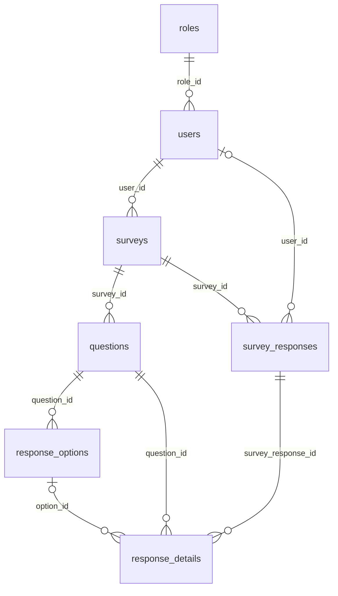

# Contrato real del backend de encuestas

> Alcance: documentación contrastada con el código que existe en `src/`, `init_database.sql` y la colección Postman del repositorio. Las afirmaciones sobre Angular no se pueden validar porque este workspace contiene solo el backend. No se leyó ni se reproduce el contenido de `.env`. Las citas enlazan a la implementación; si no hay referencia de línea, el archivo completo es la fuente.

## 1. Arquitectura y arranque

### Árbol comentado

```text
src/
├── index.ts                         Entrada; inicia PostgreSQL y HTTP en paralelo.
├── domain/                          Interfaces/contratos de User, Survey, preguntas y respuestas.
├── application/                     Casos de uso; User, Survey, SurveyResponse y Auth.
└── infraestrucure/                  Adaptadores concretos (el nombre de carpeta está así escrito).
    ├── adapter/                     Repositorios TypeORM y conversión entidad ↔ domain.
    ├── bootstrap/                   Servidor HTTP y puerto.
    ├── config/                      Configuración y validación de entorno; DataSource PostgreSQL.
    ├── controller/                  Traduce HTTP a llamadas de aplicación y respuestas JSON.
    ├── entities/                    Entidades TypeORM de las siete tablas.
    ├── routes/                      Routers, composición manual de dependencias y middleware por ruta.
    ├── util/                        Validadores Joi, compresión de imagen y alias de middleware JWT.
    └── web/                         Express, CORS, middlewares globales y middlewares JWT/rol.
```

Fuentes: [index.ts](../src/index.ts), [application](../src/application/), [domain](../src/domain/), [infraestrucure](../src/infraestrucure/).

### Arranque y orden HTTP

`src/index.ts` crea `ServerBootstrap`, llama `connectDB()` y `initialize()` dentro de `Promise.all`. El servidor HTTP puede empezar a escuchar antes de que finalice la conexión a PostgreSQL; el arranque no espera primero a la base de datos. El puerto se toma de `PORT` y el fallback del bootstrap es `4000`, aunque la validación de entorno exige `PORT`, así que con la configuración actual ese fallback no resuelve la ausencia de la variable. [index.ts](../src/index.ts#L6), [server.bootstrap.ts](../src/infraestrucure/bootstrap/server.bootstrap.ts#L11), [data-base.ts](../src/infraestrucure/config/data-base.ts#L14)

En `web/app.ts`, el orden global es:

1. `cors({ origin: 'http://localhost:4200', credentials: true })`.
2. `express.json({ limit: '50mb' })`.
3. `express.urlencoded({ extended: true, limit: '50mb' })`.
4. Routers bajo `/api`, en este orden: roles, usuarios, encuestas, respuestas.
5. `GET /api/health`.

No se monta `/api` con un router raíz: cada router individual recibe ese prefijo en `app.use`. [app.ts](../src/infraestrucure/web/app.ts#L17)

`data-base.ts` configura PostgreSQL/TypeORM, `synchronize: false`, `logging: true` y registra las siete entidades. La fuente SQL explícita es `init_database.sql`; no se encontraron archivos de migración. [data-base.ts](../src/infraestrucure/config/data-base.ts#L14), [init_database.sql](../init_database.sql#L1)

### Variables de entorno

| Variable | Lectura/uso | Obligatoria | Default comprobable |
|---|---|---:|---|
| `PORT` | Joi en `environment-vars.ts`; puerto HTTP en `server.bootstrap.ts`. | Sí | Joi no define default; bootstrap tiene fallback `4000`, pero no es alcanzable si falla la validación de `PORT`. |
| `DB_HOST` | Joi y `DataSource.host`. | Sí | Ninguno. |
| `DB_PORT` | Joi y `DataSource.port`. | No | `5432`. |
| `DB_USER` | Joi y `DataSource.username`. | Sí | Ninguno. |
| `DB_PASSWORD` | Joi y `DataSource.password`. | No; permite cadena vacía. | No hay default explícito. |
| `DB_NAME` | Joi y `DataSource.database`. | Sí | Ninguno. |
| `JWT_SECRET` | `UserController.loginUser`; se usa si está definida. | No | Sí, existe fallback de desarrollo en código; valor omitido por seguridad. `environment-vars.ts` no la valida ni la devuelve. |

`dotenv/config` carga el entorno; el objeto Joi permite variables adicionales mediante `.unknown(true)`. Existe además una segunda clave JWT fija en `AuthApplication`; no es una variable de entorno y no se publica aquí. [environment-vars.ts](../src/infraestrucure/config/environment-vars.ts#L19), [UserController.ts](../src/infraestrucure/controller/UserController.ts#L39), [AuthApplication.ts](../src/application/AuthApplication.ts#L3)

Comandos declarados: `npm run dev` (`tsx watch src/index.ts`), `npm run build` (`tsc -p .`), `npm run start` (`node dist/index.js`). [package.json](../package.json#L5)

## 2. Base de datos

Esquema documentado según `init_database.sql`; entidades según TypeORM. Todos los `SERIAL` son PK `integer`. Salvo donde se indica, no hay `UNIQUE`/`CHECK` adicional. `NOT NULL` equivale a nullable=false. [SQL](../init_database.sql#L17), [entidades](../src/infraestrucure/entities/)

| Tabla | Columna (tipo; nullable; default) → propiedad entidad | PK, FK, unique y checks |
|---|---|---|
| `roles` | `role_id` (serial; no; secuencia) → `roleId`; `name` (varchar(50); no) → `name`; `description` (varchar(255); sí) → `description`; `status` (smallint; no; 1) → `status`. | PK `role_id`; unique `name`; CHECK `status IN (0,1)`. |
| `users` | `user_id` (serial; no; secuencia) → `userId`; `name` (varchar(150); no) → `name`; `email` (varchar(255); no) → `email`; `password_hash` (varchar(255); no) → `passwordHash`; `created_at` (timestamptz; no; `CURRENT_TIMESTAMP`) → `createdAt`; `status_user` (smallint; no; 1) → `status`; `role_id` (integer; no) → `roleId`; `photo_data` (bytea; sí) → `photoData`; `photo_mime_type` (varchar(50); sí) → `photoMimeType`. | PK `user_id`; FK `role_id → roles.role_id` (UPDATE CASCADE, DELETE RESTRICT); unique `email`; CHECK `status_user IN (0,1)`. |
| `surveys` | `survey_id` (serial; no; secuencia) → `surveyId`; `title` (varchar(200); no) → `title`; `description` (text; sí) → `description`; `created_at` (timestamptz; no; `CURRENT_TIMESTAMP`) → `createdAt`; `close_date` (timestamptz; sí) → `closeDate`; `status` (smallint; no; 1) → `status`; `user_id` (integer; no) → `userId`. | PK `survey_id`; FK `user_id → users.user_id` (UPDATE CASCADE, DELETE RESTRICT); CHECK `status IN (0,1)` y `close_date IS NULL OR close_date >= created_at`. |
| `questions` | `question_id` (serial; no; secuencia) → `questionId`; `question_text` (text; no) → `questionText`; `question_type` (varchar(30); no) → `questionType`; `is_required` (boolean; no; true) → `isRequired`; `display_order` (integer; no) → `displayOrder`; `status` (smallint; no; 1) → `status`; `survey_id` (integer; no) → `surveyId`. | PK `question_id`; FK `survey_id → surveys.survey_id` (UPDATE CASCADE, DELETE RESTRICT); CHECK tipo en `Escala`, `Abierta`, `Seleccion Multiple`; CHECK status 0/1. |
| `response_options` | `option_id` (serial; no; secuencia) → `optionId`; `option_text` (varchar(300); no) → `optionText`; `display_order` (integer; no) → `displayOrder`; `status` (smallint; no; 1) → `status`; `question_id` (integer; no) → `questionId`. | PK `option_id`; FK `question_id → questions.question_id` (UPDATE CASCADE, DELETE RESTRICT); unique compuesto `(question_id, display_order)`; CHECK status 0/1. |
| `survey_responses` | `survey_response_id` (serial; no; secuencia) → `surveyResponseId`; `submitted_at` (timestamptz; no; `CURRENT_TIMESTAMP`) → `submittedAt`; `status` (smallint; no; 1) → `status`; `survey_id` (integer; no) → `surveyId`; `user_id` (integer; sí) → `userId`. | PK `survey_response_id`; FK `survey_id → surveys.survey_id` y `user_id → users.user_id` (ambas UPDATE CASCADE, DELETE RESTRICT); CHECK status 0/1. No hay unique de `(survey_id,user_id)` en el SQL. |
| `response_details` | `detail_id` (serial; no; secuencia) → `detailId`; `response_text` (text; sí) → `responseText`; `status` (smallint; no; 1) → `status`; `survey_response_id` (integer; no) → `surveyResponseId`; `question_id` (integer; no) → `questionId`; `option_id` (integer; sí) → `optionId`. | PK `detail_id`; FK a `survey_responses`, `questions`, `response_options` (UPDATE CASCADE, DELETE RESTRICT); CHECK status 0/1; CHECK `response_text IS NOT NULL OR option_id IS NOT NULL`. |

Restricciones e índices están escritos en el SQL. TypeORM no los declara como `@Check` y `synchronize` está desactivado: los CHECK/índices no se crean desde este `DataSource`. El SQL crea índices en FKs/estado; no declara intento único de respuesta. [SQL constraints e índices](../init_database.sql#L17), [DataSource](../src/infraestrucure/config/data-base.ts#L14)

No se detectó discrepancia de tipo primitivo entre las columnas mostradas en SQL y `@Column` de las entidades. Sí hay diferencias de metadatos: SQL tiene CHECKs/FKs con acciones/índices/unique compuesto que no están todos expresados con decoradores; `is_required` tiene default SQL `true` pero el decorador no especifica `default`; `created_at` y `submitted_at` tienen default SQL, mientras las entidades usan `@CreateDateColumn`. No se verificó que la base desplegada haya sido creada exactamente con este SQL. [QuestionEntity.ts](../src/infraestrucure/entities/QuestionEntity.ts#L16), [SurveyResponseEntity.ts](../src/infraestrucure/entities/SurveyResponseEntity.ts#L11)

### Relaciones



El modelo admite `user_id` nulo para la respuesta y `option_id` nulo para un detalle; las cardinalidades restantes se derivan de las FKs `NOT NULL`. [SQL FKs](../init_database.sql#L34), [SurveyResponseEntity.ts](../src/infraestrucure/entities/SurveyResponseEntity.ts#L14), [ResponseDetailEntity.ts](../src/infraestrucure/entities/ResponseDetailEntity.ts#L11)

### Equivalencias principales

| Columna BD | Propiedad entidad | Domain | Nombre JSON observado |
|---|---|---|---|
| `users.user_id` | `userId` | `User.id` | `id` en objeto usuario; login JWT añade `id`. |
| `users.name` | `name` | `name` | `name`. |
| `users.email` | `email` | `email` | `email`. |
| `users.password_hash` | `passwordHash` | `password` | Entrada `password`; se excluye en respuestas de usuario y login. |
| `users.status_user` | `status` | `status` y alias `statusUser` | Ambos `status` y `statusUser` aparecen al serializar el domain. |
| `users.role_id` | `roleId` | `roleId` | `roleId`; JWT de la ruta activa lo llama `role`. |
| `users.photo_data` / `photo_mime_type` | `photoData` / `photoMimeType` | `avatarBase64` | `avatarBase64` como Data URL. |
| `surveys.survey_id` | `surveyId` | `surveyId` | `surveyId`. |
| `surveys.status` | `status` | `status` y alias `statusSurvey` | Ambos nombres salen del domain. |
| `questions.question_id` / `question_text` / `question_type` | `questionId` / `questionText` / `questionType` | mismos nombres | mismos nombres. |
| `response_options.option_id` / `option_text` | `optionId` / `optionText` | mismos nombres | mismos nombres. |
| `survey_responses.survey_response_id` | `surveyResponseId` | `surveyResponseId` | `surveyResponseId`. |
| `response_details.detail_id` / `response_text` / `option_id` | `detailId` / `responseText` / `optionId` | mismos nombres | mismos nombres. |

Mapeo de usuario: [UserAdapter.ts](../src/infraestrucure/adapter/UserAdapter.ts#L18); interfaz: [User.ts](../src/domain/User.ts#L1). Encuesta y respuestas: [SurveyAdapter.ts](../src/infraestrucure/adapter/SurveyAdapter.ts#L18), [SurveyResponseAdapter.ts](../src/infraestrucure/adapter/SurveyResponseAdapter.ts#L30).

## 3. Endpoints

Base de rutas: `http://localhost:<PORT>/api`. Ninguna ruta de encuesta/respuestas tiene auth. Los middlewares de rol solo aparecen en las tres operaciones de baja/reactivación de usuario descritas abajo. `validateSurveyPayload`/`validateSurveyResponse` responden HTTP 400 con `{error: mensaje Joi}`. Las consultas TypeORM no se documentan como SQL literal porque la mayoría usan Repository; se muestra el QueryBuilder/SQL literal real donde existe.

### Contratos Joi compartidos

| Validador | Esquema real |
|---|---|
| Alta usuario | `name`: string trim min 3 required; `email`: string email con TLD no requerido, required; `password`: string min 6 required; `avatarBase64`: string opcional permite null/`''`; `roleId`: integer positive opcional permite null; `status`: 0/1 opcional default 1; `statusUser`: 0/1 opcional. `.unknown(true)`, `abortEarly:false`. [user_validation.ts](../src/infraestrucure/util/user_validation.ts#L19) |
| Edición usuario | `name`: string trim min 3 opcional; `email`: string trim email opcional; `password`: string min 6 opcional; `avatarBase64`: string opcional permite null/`''`; `status`, `statusUser`: 0/1 opcionales; `roleId`: integer positivo opcional. `.unknown(true)` y opciones `stripUnknown:true`, `convert:true`; aunque se permite unknown, se eliminan los campos desconocidos. [user-update-validation.ts](../src/infraestrucure/util/user-update-validation.ts#L19) |
| Encuesta create/update | `title`: string max 200 required; `description`: string opcional permite `''`; `closeDate`: fecha ISO opcional; `userId`: integer positivo required. `.unknown(true)`. No valida `questions` ni su contenido. [surveyValidator.ts](../src/infraestrucure/util/surveyValidator.ts#L8) |
| Respuesta detalle | `questionId`: integer positive required; `optionId`: integer positive opcional permite null; `responseText`: string opcional permite null/`''`; `.or('optionId','responseText')`. |
| Respuesta raíz | `surveyId`: integer positive required; `userId`: integer positive opcional permite null; `details`: array requerido min 1 de detalles; `.unknown(true)`. Joi no aplica validación relacional pregunta/encuesta. [surveyResponseValidator.ts](../src/infraestrucure/util/surveyResponseValidator.ts#L4) |

### Roles

Todos son públicos; usan directamente `AppDataSource.getRepository(RoleEntity)`, sin capa application/adaptador.

| Método y ruta | Handler; auth; entrada | Éxito | Errores y ejecución |
|---|---|---|---|
| `GET /api/roles` | Inline; ninguno. Query `includeInactive=true` opcional. | 200 array de roles, orden `roleId ASC`. | 500 `{message:"Error al consultar roles",error}`. Repository `find({where: status=1 o {}, order})`. |
| `POST /api/roles` | Inline; ninguno. Body requiere truthy `name`; lee también `description`; sin Joi ni rechazo de campos extra. | 201 entidad creada; `name` uppercase+trim, `status=1`. | 400 `{message:"El nombre del rol es obligatorio"}`; 409 `{message:"El rol ya existe"}` si PostgreSQL `23505`; 500 `{message:"Error al crear rol",error}`. Repository create/save. |
| `PATCH /api/roles/:id/deactivate` | Inline; ninguno. Param integer positivo. | 200 `{message:"Rol inactivado correctamente (status: 0 - INACTIVO)"}`. | 400 `{error:"ID inválido. Debe ser un entero positivo."}`; 404 `{message:"Rol no encontrado"}`; 500. Busca `findOneBy`, pone status 0 y save. |
| `DELETE /api/roles/:id` | Inline; ninguno. Param integer positivo. | 200 `{message:"Rol dado de baja lógicamente con éxito (status: 0 - INACTIVO)"}`. | 400/404 como arriba; 500 `{message:"Error al dar de baja el rol",error}`. Es baja lógica igual que PATCH. |
| `PATCH /api/roles/:id/activate` | Inline; ninguno. Param integer positivo. | 200 `{message:"Rol reactivado correctamente (status: 1 - ACTIVO)"}`. | 400/404 como arriba; 500. Busca, status 1, save. |

Rutas/fuentes: [RoleRoutes.ts](../src/infraestrucure/routes/RoleRoutes.ts#L7).

### Usuarios y login

| Método y ruta | Handler; middleware; entrada | Éxito | Errores, reglas y consulta |
|---|---|---|---|
| `POST /api/users` | `UserController.createUser`; público. Body: esquema alta usuario. `roleId` es aceptado por Joi, pero el controller no lo copia a domain. | 201 `{"message":"Usuario creado con éxito","userId":1}` (ID ilustrativo). | 409 si email duplicado; 400 `{error:"Error en validación o datos",details}` o mensaje del error; 500 inesperado. Application busca email y hashea bcrypt cost 10. Adapter inserta con `save`; sin `roleId` elige rol `STUDENT`, fallback role 1. No se usa `roleId` enviado en registro. |
| `POST /api/users/login` | `loginUser`; público. Body manual: `{email,password}`; ambos truthy, sin Joi. | 200 `{message:"Inicio de sesión exitoso",token:"<JWT>",user:{...sin password}}`. | 400 faltan campos; 401 `{error:"Credenciales inválidas"}` para usuario/contraseña errónea; 500 `{error,details?}`. `getUserByEmail` por email normalizado; bcrypt compare; firma JWT en controller. No bloquea usuario inactivo aquí. |
| `POST /api/login` | Alias a `loginUser`; público. Mismo body/respuesta/errores y mismo controlador que `/users/login`. | Igual al login anterior. | En el repositorio no hay fuente Angular que determine cuál consume el frontend. |
| `GET /api/users` | `getAllUsers`; `authenticateToken`. Query `includeInactive=true` opcional. | 200 array de usuarios sin password. | 500 `{message:"Error al obtener usuarios",error}`. Repository filtra status=1 salvo includeInactive, orden por `userId ASC`. |
| `GET /api/users/email/:email` | `getUserByEmail`; `authenticateToken`. Param email Joi, `.unknown(false)`. | 200 usuario sin password. | 400 error Joi; 404 `{message:"Usuario no encontrado"}`; 500. Adapter normaliza lowercase+trim y `findOne`. |
| `GET /api/users/:id` | `getUserById`; `authenticateToken`. Param entero positivo. | 200 usuario sin password. | 400 ID inválido; 404 `{error:"Usuario no encontrado"}`; 500. Repository `findOne({where:{userId:id}})`. No limita al propio usuario. |
| `PUT /api/users/:id` | `updateUser`; `authenticateToken`. Param entero positivo; body esquema edición usuario. | 200 `{message:"Usuario actualizado con éxito"}`. | 400 validación/ID; 404 `{error:"Usuario no encontrado"}`; 500 según wrapper. Application valida usuario existente, email duplicado y re-hashea password; adapter actualiza campos suministrados con `save`. Permite `roleId` y `status`, sin comprobar dueño ni que el llamante sea admin. |
| `PATCH /api/users/:id` | Mismo controlador y validación que PUT; `authenticateToken`. | Igual a PUT. | Igual a PUT. |
| `DELETE /api/users/:id` | `deleteUser`; `authenticateToken`, `authorizeRole(1)`. Param entero positivo. | 200 `{message:"Usuario dado de baja lógicamente con éxito (status: 0 - INACTIVO)"}`. | 400 ID; 404 usuario no encontrado; 500. Actualiza status=0; no borra físicamente. |
| `PATCH /api/users/:id/deactivate` | `deactivateUser`; `authenticateToken`, `authorizeRole(1)`. | 200 `{message:"Usuario inactivado correctamente (status: 0 - INACTIVO)"}`. | 400/404; 500 `{error:"Error al inactivar usuario"}`. status=0. |
| `PATCH /api/users/:id/activate` | `activateUser`; `authenticateToken`, `authorizeRole(1)`. | 200 `{message:"Usuario reactivado correctamente (status: 1 - ACTIVO)"}`. | 400/404; 500 `{error:"Error al reactivar usuario"}`. status=1. |

Fuentes: [UserRoutes.ts](../src/infraestrucure/routes/UserRoutes.ts#L19), [UserController.ts](../src/infraestrucure/controller/UserController.ts#L17), [UserApplication.ts](../src/application/UserApplication.ts#L13), [UserAdapter.ts](../src/infraestrucure/adapter/UserAdapter.ts#L32).

### Encuestas

En el esquema de entrada compartido, `questions` y otras propiedades son aceptadas como unknown, pero no se validan. El listado recibe `includeInactive` y `userId` en query. [SurveyRoutes.ts](../src/infraestrucure/routes/SurveyRoutes.ts#L14)

| Método y ruta | Handler; middleware; params/query/body | Éxito | Errores, regla y consulta |
|---|---|---|---|
| `POST /api/surveys` | `SurveyController.create`; ninguno. Body esquema encuesta. `userId` obligatorio; opcional `questions` no validado. | 201 `{"message":"Encuesta creada con éxito en estado Borrador","surveyId":1}`. | 400 `{error:mensaje}`. Application valida título no vacío y `userId`; crea con status=1. Adapter transaccional save encuesta y preguntas/opciones activas. El texto “Borrador” contradice status 1 llamado activo/publicado en la lógica. |
| `GET /api/surveys` | `getAll`; ninguno. Query `includeInactive=true`, `userId` numérico opcional. | 200 array de encuestas con `totalQuestions` y `completed` calculados. | 500 `{error:message}`. Repository lee encuestas, filtra status 1 salvo includeInactive; SQL `SELECT survey_id, COUNT(*) AS total FROM questions WHERE status::text = '1' GROUP BY survey_id`. Si `userId` truthy: `SELECT DISTINCT survey_id FROM survey_responses WHERE user_id = $1`; marca completada si existe alguna respuesta, sin filtrar status. |
| `GET /api/surveys/:id` | `getById`; ninguno. Param entero positivo. | 200 survey con preguntas/opciones activas ordenadas por displayOrder. | 400 ID inválido; 404 `{error:message}` si falla aplicación; adapter `findOneBy` más preguntas con `relations:{options:true}`. |
| `PUT /api/surveys/:id` | `update`; ninguno. Param entero positivo y body esquema encuesta (requiere `title` y `userId` incluso para actualizar). Preguntas extras no validadas. | 200 `{message:"Encuesta actualizada correctamente"}`. | 400 `{error:message}`. No permite actualizar si status 0. Si viene `questions`, desactiva las existentes y opciones y crea reemplazos dentro de transacción; no comprueba propietario. |
| `PATCH /api/surveys/:id/publish` | `publish`; ninguno. Param entero positivo, no body requerido. | 200 `{message:"Encuesta publicada exitosamente y disponible (status: 1 - ACTIVO)"}`. | 400 ID/error; solo actualiza si existe y status !=1; si ya 1 error. Repository update status=1. |
| `PATCH /api/surveys/:id/activate` | `activate`; ninguno. Param entero positivo. | 200 `{message:"Encuesta reactivada exitosamente (status: 1 - ACTIVO)"}`. | 400 ID/error; error si no existe o ya está activa; Repository update status=1. |
| `PATCH /api/surveys/:id/deactivate` | `deactivate`; ninguno. Param entero positivo. | 200 `{message:"Encuesta inactivada lógicamente (status: 0 - INACTIVO)"}`. | 400 ID/error; error si no existe o ya está inactiva; Repository update status=0. |
| `DELETE /api/surveys/:id` | `delete`, delega a `deactivate`; ninguno. Param entero positivo. | Igual a PATCH deactivate. | 400 ID/error; baja lógica, no DELETE SQL. |

Fuentes: [SurveyController.ts](../src/infraestrucure/controller/SurveyController.ts#L8), [SurveyApplication.ts](../src/application/SurveyApplication.ts#L8), [SurveyAdapter.ts](../src/infraestrucure/adapter/SurveyAdapter.ts#L85).

### Respuestas

| Método y ruta | Handler; middleware; params/body | Éxito | Errores, reglas y consulta |
|---|---|---|---|
| `POST /api/surveys/:surveyId/responses` | `submit`; solo `validateSurveyResponse`, sin auth. Path `surveyId` entero positivo. Body Joi descrito arriba; el controller usa `body.user.id` o `body.userId`, convierte ids de detalle a números. | 201 `{"message":"Respuestas enviadas y guardadas con éxito","surveyResponseId":1}`. | 400 ID, Joi o aplicación (`surveyId` requerido y details no vacío); 409 `{error:"Ya respondiste esta encuesta. Solo se permite un intento."}` si error SQL unique/duplicate; otro error 400. Application solo valida surveyId/details no vacíos. Adapter `repository.save` con `details` en cascade; no hay preconsulta de duplicado. |
| `GET /api/surveys/:surveyId/responses` | `getResults`; ninguno. Path `surveyId` entero positivo, no query. | 200 array `{surveyResponseId,submittedAt,surveyId,userId,status,details:[{detailId,questionId,optionId,responseText,status}]}`. | 400 ID inválido; 500 `{error:message}`. Application valida truthiness de ID. Adapter `find({where:{surveyId}, relations:{details:true}, order:{surveyResponseId:'ASC'}}`; no incluye pregunta/opción/usuario y no filtra status. |

Fuentes: [surveyResponseRoutes.ts](../src/infraestrucure/routes/surveyResponseRoutes.ts#L13), [SurveyResponseController.ts](../src/infraestrucure/controller/SurveyResponseController.ts#L10), [SurveyResponseApplication.ts](../src/application/SurveyResponseApplication.ts#L7), [SurveyResponseAdapter.ts](../src/infraestrucure/adapter/SurveyResponseAdapter.ts#L11).

### Salud

| Método y ruta | Auth/entrada | Éxito | Error/consulta |
|---|---|---|---|
| `GET /api/health` | Público; sin params/query/body. | 200 `{"status":"UP","message":"Backend Encuestas funcionando con TypeORM y PostgreSQL"}`. | No tiene try/catch. No verifica explícitamente conexión DB al responder. |

Fuente: [app.ts](../src/infraestrucure/web/app.ts#L33).

## 4. Autenticación y autorización

### Login y verificación JWT

Las rutas `/api/login` y `/api/users/login` invocan `UserController.loginUser` directamente. Valida presencia de email/password, consulta usuario por email y compara `bcrypt.compare(password, user.password)`; `UserAdapter` mapea `password_hash` a `password`. El token se firma en el controller con clave `process.env.JWT_SECRET` o un fallback de desarrollo (valor omitido), expiración `2h` y payload exacto `{id:user.id,email:user.email,role:user.roleId || user.roleId}`; la expresión de role siempre equivale a `user.roleId`. Respuesta incluye token y usuario sin password. No se valida estado de usuario en este método. [UserController.ts](../src/infraestrucure/controller/UserController.ts#L17)

Existe otro método `UserApplication.login`, que no es el invocado por las rutas. Este comprueba estado activo y password, y llama `AuthApplication.generateToken({userId,email,roleId})`. `AuthApplication` usa una clave hard-coded distinta a la clave/fallback del controller y expira en `1h`. En el árbol actual no se usa `UserApplication.login`; por tanto esos comportamientos no son el login HTTP vigente. [UserApplication.ts](../src/application/UserApplication.ts#L26), [AuthApplication.ts](../src/application/AuthApplication.ts#L3), [UserRoutes.ts](../src/infraestrucure/routes/UserRoutes.ts#L28)

`authenticateToken` lee `Authorization`, toma el segundo componente separado por espacio (`Bearer <token>`), verifica llamando a `AuthApplication.verifyToken` y asigna el payload completo a `(req as any).user`. Sin token devuelve 401 `{error:"Acceso no autorizado: Se requiere token de autenticación"}`; excepción de verify devuelve 403 `{error:"Token inválido o expirado"}`. No copia `user` a `req.body.user`. `authorizeRole` requiere `req.user`, toma `user.roleId ?? user.role`, y compara estrictamente con roles permitidos; sin usuario 401, rol no permitido 403 `{error:"Acceso denegado: permisos insuficientes para realizar esta acción"}`. [authMiddleware.ts](../src/infraestrucure/web/authMiddleware.ts#L7), [roleMiddleware.ts](../src/infraestrucure/web/roleMiddleware.ts#L10)

**Incompatibilidad confirmada:** el login HTTP firma con `JWT_SECRET` del entorno/fallback; el middleware verifica con la clave fija dentro de `AuthApplication`. No son la misma fuente/clave por diseño, por tanto el JWT del login HTTP no verifica salvo coincidencia accidental de configuración con la clave fija. El payload del login HTTP usa `id` y `role`; middleware no exige `userId`, y `authorizeRole` sí acepta el campo `role`, así que el payload sería legible por el middleware de rol si llegase a verificarse. En cambio el JWT del `UserApplication.login` usa la clave de `AuthApplication` y `roleId`, aunque ese método no atiende ninguna ruta. [UserController.ts](../src/infraestrucure/controller/UserController.ts#L39), [AuthApplication.ts](../src/application/AuthApplication.ts#L3), [roleMiddleware.ts](../src/infraestrucure/web/roleMiddleware.ts#L19)

### Acceso efectivo y riesgos

Públicos: roles completos, registro y ambos login, todo `/surveys`, ambas rutas de `/surveys/:surveyId/responses` y health. Protegidos por token: GET/PUT/PATCH usuarios; solo DELETE/inactivar/reactivar usuario además exige role 1. [UserRoutes.ts](../src/infraestrucure/routes/UserRoutes.ts#L19), [SurveyRoutes.ts](../src/infraestrucure/routes/SurveyRoutes.ts#L14), [surveyResponseRoutes.ts](../src/infraestrucure/routes/surveyResponseRoutes.ts#L13), [RoleRoutes.ts](../src/infraestrucure/routes/RoleRoutes.ts#L7)

Riesgos observados en código:

- Las rutas de roles son públicas: cualquiera puede crear roles o inactivar/reactivar roles.
- Encuestas y resultados/respuestas son públicos; no se exige identidad en consulta ni escritura.
- PUT/PATCH usuario permite modificar `roleId` y `status` con cualquier token válido; no se compara `:id` con el usuario autenticado ni se exige role admin.
- `POST /users` permite que Joi acepte `roleId`, aunque `createUser` lo descarta al construir el domain; adapter asigna STUDENT si no hay role. Confirmado en el flujo actual, no concluyo que sea escalación por este body.
- Crear encuesta acepta `userId` del body, y enviar respuesta acepta `userId` del body; no se vinculan al JWT ni se verifica dueño.
- Encuesta/respuesta no comprueban que la pregunta/option pertenezca a la encuesta/question.
- Error 409 de intento único no está respaldado por unique constraint ni preconsulta en código SQL/adapter inspeccionados.

## 5. Flujos de negocio de punta a punta

### Registro

`POST /api/users` valida campos, UserApplication comprueba email existente y aplica bcrypt cost 10, UserAdapter normaliza email, comprime opcionalmente la foto y persiste. El controller construye `{name,email,password,status}`: ignora `avatarBase64`, `roleId` y `statusUser` aunque el validador los acepte. Por tanto el endpoint actual de alta no persiste foto y el rol se resuelve al default STUDENT (role 1 solo si no encuentra STUDENT). [UserController.ts](../src/infraestrucure/controller/UserController.ts#L75), [UserApplication.ts](../src/application/UserApplication.ts#L13), [UserAdapter.ts](../src/infraestrucure/adapter/UserAdapter.ts#L32)

### Login y edición de perfil

Login descrito en sección 4. No hay `PUT /api/profile`; existe `PUT /api/users/:id`, protegido solo con token. La edición acepta `avatarBase64`, pero para actualizar nombre/correo/password/rol/estado requiere que el caller incluya esos campos si desea cambiarlos. Usuario no-owner también puede ser objetivo; permite cambiar `roleId`. [UserRoutes.ts](../src/infraestrucure/routes/UserRoutes.ts#L68), [user-update-validation.ts](../src/infraestrucure/util/user-update-validation.ts#L19)

Al actualizar la foto por esta ruta: `compressImage` detecta Data URL `data:<mime>;base64,` o trata texto como Base64 puro (MIME predeterminado `image/jpeg`), convierte con `Buffer.from(...,'base64')`, aplica gzip nivel 9 y guarda bytes en `photo_data` y MIME en `photo_mime_type`. Adapter/domain recupera con gunzip y devuelve Data URL `avatarBase64`; si falla gunzip, devuelve el buffer como Base64 sin gzip. Enviar `null` o `''` por update borra ambos valores. El alta ignora la foto como indicado. [imageCompressor.ts](../src/infraestrucure/util/imageCompressor.ts#L10), [UserAdapter.ts](../src/infraestrucure/adapter/UserAdapter.ts#L18)

### Crear y editar encuesta

`POST /surveys`: middleware comprueba `title`, `description`, `closeDate`, `userId`; el controller pasa `questions` sin validar. Application valida title no vacío y userId truthy, asigna status 1. Adapter transaccional crea encuesta, cada pregunta y opción activa. Para preguntas requiere operativamente los nombres domain `questionText`, `questionType`, `isRequired`, `displayOrder`, y `options[]` con `optionText`/`displayOrder`; no hay Joi de pregunta conectado a la ruta. [SurveyRoutes.ts](../src/infraestrucure/routes/SurveyRoutes.ts#L14), [SurveyAdapter.ts](../src/infraestrucure/adapter/SurveyAdapter.ts#L29), [questionValidator.ts](../src/infraestrucure/util/questionValidator.ts#L19)

`PUT /surveys/:id`: pasa req.body tras la validación común; application impide editar solo si status 0 (no si está publicado status 1). Adapter actualiza campos generales presentes; si `questions` existe, desactiva preguntas/opciones previas y las sustituye por nuevas conservando historial. No modifica `userId` en su `updateData`, aunque Joi lo exija. [SurveyApplication.ts](../src/application/SurveyApplication.ts#L47), [SurveyAdapter.ts](../src/infraestrucure/adapter/SurveyAdapter.ts#L149)

### Listar encuestas

Por defecto excluye status 0, pero status 1 incluye cualquier registro activo independientemente de si negocio lo denomina borrador o publicado. Agrega `totalQuestions` contando preguntas status 1. `completed` solo se calcula si query tiene `userId`; es true si hay alguna fila `survey_responses` de ese usuario/encuesta, incluso si su status está inactivo. [SurveyAdapter.ts](../src/infraestrucure/adapter/SurveyAdapter.ts#L85)

### Responder encuesta

Body exacto mínimo aceptado:

```json
{
  "surveyId": 12,
  "userId": 34,
  "details": [
    { "questionId": 101, "optionId": 203 },
    { "questionId": 102, "responseText": "Texto libre" }
  ]
}
```

Path `/api/surveys/12/responses` es la fuente del surveyId efectivo; body validator también exige un `surveyId` válido, aunque controller lo reemplaza con el path. El usuario puede omitirse y guardarse como NULL. El adapter guarda fila en `survey_responses` y un `response_details` por item mediante cascade. Restricción SQL solo exige que cada detalle tenga texto no NULL o option_id no NULL; Joi `.or` permite el campo aunque su valor sea `null` o `''`, así que la base puede rechazarlo. El mensaje “solo un intento” existe en controlador para duplicate key, pero no hay constraint única en SQL ni control previo comprobado. Para tipo `Escala`, código no define un mapeo especial: se guarda `option_id`, `response_text` o ambos según el body; la interpretación numérica de escala es NO VERIFICADA. [surveyResponseValidator.ts](../src/infraestrucure/util/surveyResponseValidator.ts#L4), [SurveyResponseController.ts](../src/infraestrucure/controller/SurveyResponseController.ts#L20), [SurveyResponseAdapter.ts](../src/infraestrucure/adapter/SurveyResponseAdapter.ts#L11), [SQL](../init_database.sql#L88)

### Obtener resultados

`GET /api/surveys/:surveyId/responses` devuelve filas cabecera y detalles; no adjunta texto de pregunta/opción, nombre/email del usuario ni agregados. Se detalla en sección 6. [SurveyResponseAdapter.ts](../src/infraestrucure/adapter/SurveyResponseAdapter.ts#L30)

## 6. Datos disponibles para estadísticas

El método actual es `SurveyResponseApplication.getResults` → `SurveyResponseAdapter.getResponsesBySurvey`. Hace un `Repository.find` filtrado por `surveyId`, carga `details`, ordena por `surveyResponseId ASC` y mapea cada fila a:

```json
{
  "surveyResponseId": 1,
  "submittedAt": "<fecha ISO>",
  "surveyId": 12,
  "userId": 34,
  "status": 1,
  "details": [
    { "detailId": 1, "questionId": 101, "optionId": 203, "responseText": null, "status": 1 }
  ]
}
```

`optionId` o `responseText` pueden faltar o ser nulos. No se filtran responses/details inactivos ni se cargan relaciones pregunta/opción/usuario. [SurveyResponseApplication.ts](../src/application/SurveyResponseApplication.ts#L24), [SurveyResponseAdapter.ts](../src/infraestrucure/adapter/SurveyResponseAdapter.ts#L30)

Con las tablas actuales pueden agregarse consultas como estas; no son endpoints existentes:

```sql
-- Respuestas por encuesta (usar status=1 si solo interesan activas)
SELECT survey_id, COUNT(*) AS total_responses
FROM survey_responses
WHERE status = 1
GROUP BY survey_id;

-- Conteo de selección por opción en una encuesta
SELECT q.question_id, o.option_id, o.option_text, COUNT(*) AS selections
FROM response_details d
JOIN survey_responses r ON r.survey_response_id = d.survey_response_id
JOIN questions q ON q.question_id = d.question_id
JOIN response_options o ON o.option_id = d.option_id
WHERE r.survey_id = $1 AND q.question_type = 'Seleccion Multiple'
  AND r.status = 1 AND d.status = 1
GROUP BY q.question_id, o.option_id, o.option_text;

-- Promedio de Escala SOLO si display_order es el valor numérico de cada opción
SELECT q.question_id, AVG(o.display_order::numeric) AS average_score
FROM response_details d
JOIN survey_responses r ON r.survey_response_id = d.survey_response_id
JOIN questions q ON q.question_id = d.question_id
JOIN response_options o ON o.option_id = d.option_id
WHERE r.survey_id = $1 AND q.question_type = 'Escala'
  AND r.status = 1 AND d.status = 1
GROUP BY q.question_id;

-- Textos de preguntas abiertas
SELECT q.question_id, d.response_text
FROM response_details d
JOIN survey_responses r ON r.survey_response_id = d.survey_response_id
JOIN questions q ON q.question_id = d.question_id
WHERE r.survey_id = $1 AND q.question_type = 'Abierta'
  AND d.response_text IS NOT NULL AND r.status = 1 AND d.status = 1;

-- Usuarios cuyo role_id es 2; agregar AND status_user = 1 para activos
SELECT COUNT(*) AS users_role_2 FROM users WHERE role_id = 2;
```

El promedio SQL anterior solo es correcto si `display_order` representa el valor de la escala; alternativa: promediar `response_text::numeric` si se acuerda guardar allí números. El código actual no fija ninguna de esas convenciones. No usar `option_id` numérico como calificación: es solo identificador.

## 7. Rutas que espera el frontend

La columna EXISTE indica coincidencia de método y ruta base observada bajo `/api`. No hay código Angular en el workspace y la colección Postman tampoco prueba cuál ruta llama el frontend. `POST /api/login` y `/api/users/login` son alias implementados por el mismo controller.

| Ruta solicitada | Estado | Ruta/capacidad real |
|---|---|---|
| `POST /api/login` | EXISTE | Alias de login. También `POST /api/users/login`. Frontend: NO VERIFICADO. |
| `POST /api/users` | EXISTE | Registro. |
| `PUT /api/users/:id` | EXISTE | Actualización genérica por id, requiere token. |
| `PUT /api/profile` | NO EXISTE | NO ENCONTRADO. |
| `POST /api/forgot-password` | NO EXISTE | NO ENCONTRADO. |
| `GET /api/surveys` | EXISTE | Listado. |
| `POST /api/surveys` | EXISTE | Creación. |
| `PUT /api/surveys` | EXISTE CON OTRA RUTA | Solo `PUT /api/surveys/:id`. |
| `GET /api/surveys/:id` | EXISTE | Detalle. |
| `PATCH /api/surveys/:id/publish` | EXISTE | Publica/activa status 1. |
| `PATCH /api/surveys/:id/deactivate` | EXISTE | Inactiva status 0. |
| `GET /api/surveys/:id/responses` | EXISTE CON OTRA RUTA | Implementado como `GET /api/surveys/:surveyId/responses`; equivalente de segmentos. |
| `POST /api/surveys/:id/responses` | EXISTE CON OTRA RUTA | Implementado como `POST /api/surveys/:surveyId/responses`; equivalente de segmentos. |
| `GET /api/surveys/:id/estudiantes` | NO EXISTE | NO ENCONTRADO. |
| `GET /api/surveys/:id/estudiantes/:estudianteId/respuestas` | NO EXISTE | NO ENCONTRADO. |
| `GET /api/surveys/qr/:id` | NO EXISTE | NO ENCONTRADO. |

Inspección de rutas: [UserRoutes.ts](../src/infraestrucure/routes/UserRoutes.ts), [SurveyRoutes.ts](../src/infraestrucure/routes/SurveyRoutes.ts), [surveyResponseRoutes.ts](../src/infraestrucure/routes/surveyResponseRoutes.ts). En Postman sí aparecen login/registro, encuestas y respuestas, pero ninguna de estudiantes, perfil, recuperación o QR; no contiene petición de login. [Colección Postman](../Proyecto_Encuestas.postman_collection.json)

## 8. Deuda técnica y problemas observados

- `README.MD` y `dev2.MD` no son fuente confiable de contrato: describen variables/configuración/esquemas antiguos, incluyendo `synchronize:true`, nombres `id_user`/`password_user` y UUID, que contradicen el `DataSource`, SQL y entidades actuales. [README.MD](../README.MD), [dev2.MD](../dev2.MD), [data-base.ts](../src/infraestrucure/config/data-base.ts#L20)
- Login duplicado y claves JWT divergentes; el login de ruta no genera un token verificable por el middleware en la configuración ordinaria. [UserRoutes.ts](../src/infraestrucure/routes/UserRoutes.ts#L28), [UserController.ts](../src/infraestrucure/controller/UserController.ts#L39), [AuthApplication.ts](../src/application/AuthApplication.ts#L3)
- El registro valida foto, rol y `statusUser` pero el controller descarta esos campos. Validación `roleId` nula también es aceptada, aunque roleId no pasa al adapter. [user_validation.ts](../src/infraestrucure/util/user_validation.ts#L46), [UserController.ts](../src/infraestrucure/controller/UserController.ts#L78)
- Límites incoherentes: Joi alta/edición solo valida mínimo de `name`, no máximo 150 pese a la columna; SQL/entidad limitan optionText a 300 y title a 200, Joi solo establece ambos máximos pero no valida nombre ni la estructura interna de opciones/preguntas. `questionPayloadSchema` incluye `surveyId` requerido por cada pregunta, no se invoca desde creación/edición de survey y `.unknown(true)` admite campos extra. [User.ts entidad](../src/infraestrucure/entities/User.ts#L9), [surveyValidator.ts](../src/infraestrucure/util/surveyValidator.ts#L8), [questionValidator.ts](../src/infraestrucure/util/questionValidator.ts#L19)
- `questionValidator.ts` no está importado por ninguna ruta; `questionPayloadSchema` no tiene consumidor encontrado. `UserApplication.login` tampoco está conectado a ruta. `jwt-middleware.ts` es una reexportación de compatibilidad; no está montada directamente. [questionValidator.ts](../src/infraestrucure/util/questionValidator.ts#L19), [UserApplication.ts](../src/application/UserApplication.ts#L26), [jwt-middleware.ts](../src/infraestrucure/util/jwt-middleware.ts#L1)
- Registro HTTP no usa `UserApplication.login` y no bloquea usuarios inactivos. La consulta por correo tampoco filtra estado.
- Survey API llama status 1 “Borrador” en respuesta de creación, mientras el código comenta status 1 como activo/publicado y solo bloquea update cuando status=0. [SurveyController.ts](../src/infraestrucure/controller/SurveyController.ts#L19), [SurveyApplication.ts](../src/application/SurveyApplication.ts#L5)
- Survey create/update requiere `userId` Joi aunque update no lo utiliza; adapter update no modifica owner. Fecha de cierre no se verifica al responder y SQL check solo impone que no sea anterior a created_at.
- Errores HTTP: `GET /surveys/:id` convierte cualquier error (incluso interno) en 404; create/update/status convierten todo en 400; `GET results` usa 500; update usuario devuelve 400 para error de negocio/no encontrado lanzado desde application; wrappers de rutas transforman excepciones capturadas en 500. No hay formato global uniforme.
- El controller de respuesta anuncia 409 por duplicado, pero SQL no define constraint unique por usuario/encuesta; anonymous `user_id NULL` no podría beneficiarse de un unique ordinario sin tratamiento adicional. La regla de intento único no está garantizada. [SurveyResponseController.ts](../src/infraestrucure/controller/SurveyResponseController.ts#L33), [SQL](../init_database.sql#L78)
- No hay verificación del dueño de la encuesta ni coherencia de `questionId`/`optionId` durante respuesta. La base preserva FKs pero no constraint que ate question a la encuesta y option a question.
- `SurveyAdapter.findAll` usa `status::text = '1'` en SQL; otras consultas se hacen mediante TypeORM. `completed` cuenta cualquier respuesta existente sin status filter.
- `PORT` se marca required aunque el bootstrap tenga fallback. `connectDB` llama `process.exit(1)` al fallar; Promise.all arranca servidor simultáneamente. [environment-vars.ts](../src/infraestrucure/config/environment-vars.ts#L19), [index.ts](../src/index.ts#L8), [data-base.ts](../src/infraestrucure/config/data-base.ts#L33)
- El DataSource usa logging SQL en todas las conexiones y no sincroniza entidades. Que se apliquen constraints depende de inicializar la BD con el SQL correcto; no hay migraciones detectadas.
- No se encontraron tests `*.spec.*`/`*.test.*` ni archivos de Angular en este workspace. TODOs: NO ENCONTRADOS mediante búsqueda de marcadores/archivos inspeccionados; no equivale a certificar cada comentario del repositorio completo.

## 9. Guía rápida para probar

Usar la URL del puerto indicado en `.env` (`PORT` requerido). La base debe estar creada con `init_database.sql`, roles seed 1/2 disponibles y aplicación ejecutándose. No se da por hecho que el token recibido en login funcione en rutas protegidas: las claves JWT están desalineadas.

### Login

```bash
curl -i -X POST http://localhost:4000/api/login \
  -H "Content-Type: application/json" \
  -d '{"email":"admin@encuestas.com","password":"<contraseña configurada para ese usuario>"}'
```

El SQL inserta un hash para admin, no permite deducir aquí la contraseña en claro ni verificarla; reemplazar el ejemplo con credenciales conocidas. Otra ruta equivalente es `/api/users/login`.

### Crear encuesta

```bash
curl -i -X POST http://localhost:4000/api/surveys \
  -H "Content-Type: application/json" \
  -d '{"title":"Encuesta de prueba","description":"Prueba de contrato","closeDate":"2026-12-20T23:59:59.000Z","userId":1,"questions":[{"questionText":"¿Cómo califica?","questionType":"Escala","isRequired":true,"displayOrder":1,"options":[{"optionText":"1","displayOrder":1},{"optionText":"5","displayOrder":2}]},{"questionText":"Comentario","questionType":"Abierta","isRequired":false,"displayOrder":2}]}'
```

La estructura de preguntas coincide con lo que el adapter consume; la ruta no valida su esquema ni los valores permitidos. El SQL sí tiene CHECK para `question_type`.

### Responder encuesta

```bash
curl -i -X POST http://localhost:4000/api/surveys/1/responses \
  -H "Content-Type: application/json" \
  -d '{"surveyId":1,"userId":2,"details":[{"questionId":1,"optionId":1},{"questionId":2,"responseText":"Buena experiencia"}]}'
```

IDs deben existir y respetar FKs. Para intento único no confiar en la respuesta 409: el SQL inspeccionado no la garantiza.

### Listar encuestas y resultados

```bash
curl -i "http://localhost:4000/api/surveys?userId=2"
curl -i "http://localhost:4000/api/surveys/1"
curl -i "http://localhost:4000/api/surveys/1/responses"
```

Para consultar usuarios, usar `GET /api/users` con `Authorization: Bearer <token>`; en el estado actual el JWT de login HTTP podría ser rechazado por la clave de verificación distinta.